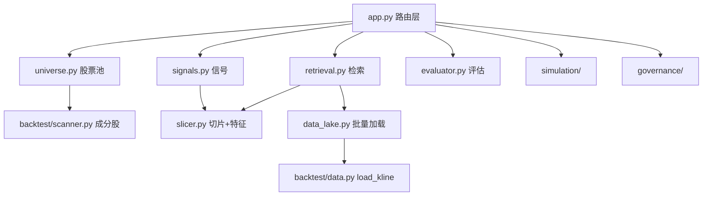
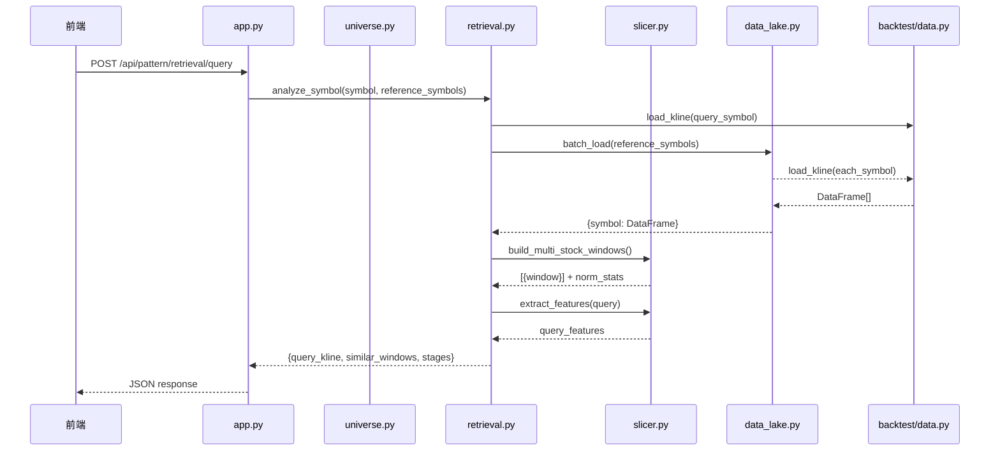

# BE-000 项目模块骨架 — 实现文档

## 1. 模块划分

```
trade/
├── pattern_matching/     # 核心算法模块
│   ├── __init__.py       # 统一导出
│   ├── models.py         # 业务对象（BE-001）
│   ├── signals.py        # 信号侦测（BE-021）
│   ├── slicer.py         # K线切片+特征（BE-020/BE-030/BE-031）
│   ├── retrieval.py      # 相似检索（BE-032）
│   ├── evaluator.py      # 策略评估（BE-040）
│   ├── data_lake.py      # 批量加载（BE-012）
│   └── universe.py       # 股票池管理（BE-010）
├── simulation/            # Walk-Forward 模块
│   ├── __init__.py
│   ├── time_gate.py       # Point-in-Time 门控（BE-002）
│   ├── wf_engine.py       # WF 引擎（BE-051）
│   ├── rebalance.py       # 持仓再评估（BE-062）
│   └── reporter.py        # 绩效报告（BE-052）
├── governance/            # 治理模块
│   ├── __init__.py
│   ├── tracking.py        # 后验跟踪（BE-080）
│   ├── drift_monitor.py   # 漂移监控（BE-081）
│   └── lifecycle.py       # 策略生命周期（BE-082）
└── app.py                 # 仅保留路由/任务入口
```

## 2. 模块间依赖关系



## 3. 时序逻辑



## 4. API 路由汇总

| 方法 | 路径 | 对应需求 |
|------|------|----------|
| GET | /pattern-research | FE-030 页面 |
| POST | /api/pattern/retrieval/query | BE-033 |
| POST | /api/pattern/analyze | BE-042 |
| POST | /api/pattern/signals | BE-022 |
| GET | /api/universe/options | BE-010 |
| POST | /api/universe/preview | BE-010 |
| POST | /api/universe | BE-010 |
| GET | /api/universe/{id} | BE-010 |
| GET | /api/universe | BE-010 |
