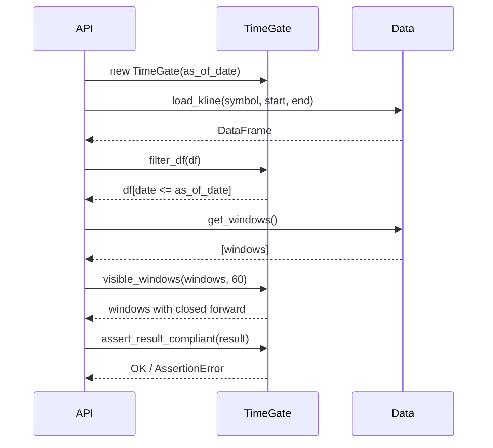

# BE-002 Point-in-Time 时间门控 — 实现文档

## 1. 模块位置

`simulation/time_gate.py`

## 2. 数据结构

```python
class TimeGate:
    as_of_date: str           # 信息截止日 "YYYY-MM-DD"
    _as_of_dt: datetime       # 内部datetime对象
```

## 3. 接口与方法

### 3.1 构造函数

```python
gate = TimeGate(as_of_date="2026-06-29")
```

### 3.2 filter_df — 过滤未来数据

```python
def filter_df(df: pd.DataFrame, date_col: str = "date") -> pd.DataFrame:
    """保留 date <= as_of_date 的行"""
```

**参数：**
- `df` - 包含 date 列的数据框
- `date_col` - 日期列名，默认 "date"

**返回：** 过滤后的 DataFrame

### 3.3 is_forward_complete — 前瞻窗口闭合检查

```python
def is_forward_complete(anchor_date: str, forward_days: int) -> bool:
    """检查 anchor_date + forward_days + 10天 <= as_of_date"""
```

**参数：**
- `anchor_date` - 锚定日 "YYYY-MM-DD"
- `forward_days` - 前瞻天数（交易日）

**返回：** True = 窗口已闭合可用

### 3.4 visible_windows — 过滤可用片段

```python
def visible_windows(windows: list, forward_days: int) -> list:
    """从片段列表过滤出前瞻窗口已闭合的"""
```

**参数：**
- `windows` - list of dict，每个含 `anchor_date`
- `forward_days` - 前瞻天数

### 3.5 assert_no_future_data — 泄漏断言

```python
def assert_no_future_data(dates, label="data"):
    """断言所有日期的 <= as_of_date，否则抛出 AssertionError"""
```

### 3.6 assert_result_compliant — API结果合规检查

```python
def assert_result_compliant(result: dict):
    """检查 API 结果的 as_of_date 一致性和无未来信号"""
```

## 4. 时序逻辑



## 5. 验收结果

```
filter_df: 正确过滤未来数据
is_forward_complete: 正确判断窗口闭合
visible_windows: 正确过滤未闭合窗口
assert_no_future_data: 正确捕获未来数据
assert_no_future_data: 通过合法数据
assert_result_compliant: 合法结果通过
assert_result_compliant: 捕获as_of_date不一致
```
