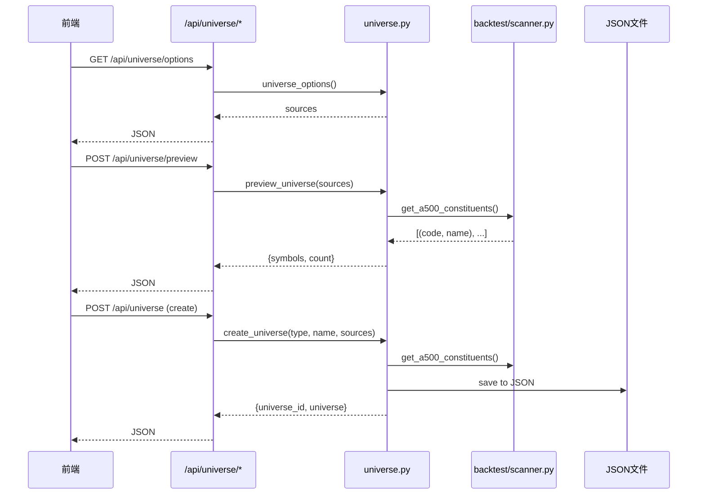

# BE-010 股票池管理 — 实现文档

## 1. 模块位置

`pattern_matching/universe.py` + `app.py` 路由

## 2. 数据结构

```json
{
  "universe_id": "reference_A500_1719660000",
  "universe_type": "reference",       // "trading" | "reference"
  "name": "A500参考池",
  "sources": ["a500"],                // 数据来源
  "custom_symbols": ["600519"],       // 自定义补充
  "symbols": [                        // 展开后的完整列表
    {"symbol": "600519", "name": "贵州茅台", "market": "cn"}
  ],
  "count": 501,
  "created_at": "2026-06-29 18:00:00",
  "updated_at": "2026-06-29 18:00:00"
}
```

**存储**: `data_cache/universe_configs.json`

## 3. API 接口

### 3.1 获取可选来源

```
GET /api/universe/options
```

**响应：**
```json
{
  "ok": true,
  "sources": [
    {"id": "a500", "name": "中证A500成分股", "market": "cn"},
    {"id": "sp500", "name": "标普500成分股", "market": "us"},
    {"id": "hk_large", "name": "港股大市值(≥1000亿)", "market": "hk"},
    {"id": "custom", "name": "自定义列表", "market": "mixed"}
  ]
}
```

### 3.2 预览股票池

```
POST /api/universe/preview
{"sources": ["a500"], "custom_symbols": ["600519"]}
```

**响应：** `{"ok": true, "symbols": [...], "count": 501}`

### 3.3 创建/更新股票池

```
POST /api/universe
{"type": "reference", "name": "我的参考池", "sources": ["a500"], "custom_symbols": ["600519"]}
```

**响应：** `{"ok": true, "universe": {...}}`

### 3.4 查询单个股票池

```
GET /api/universe/{universe_id}
```

### 3.5 列出所有股票池

```
GET /api/universe?type=reference
```

## 4. 时序逻辑



## 5. 函数签名

```python
def universe_options() -> dict
def preview_universe(sources: List[str], custom_symbols: List[str] = None) -> dict
def create_universe(universe_type: str, name: str, sources: List[str], custom_symbols: List[str] = None) -> dict
def get_universe(universe_id: str) -> dict
def list_universes(universe_type: str = None) -> dict
```

## 6. 验收结果

```
GET /api/universe/options OK: ['a500', 'sp500', 'hk_large', 'custom']
POST /api/universe/preview OK: count=500
POST /api/universe (create) OK: uid=reference_xxxxx
GET /api/universe/{id} OK: type=reference
GET /api/universe (list) OK: count=1
```
