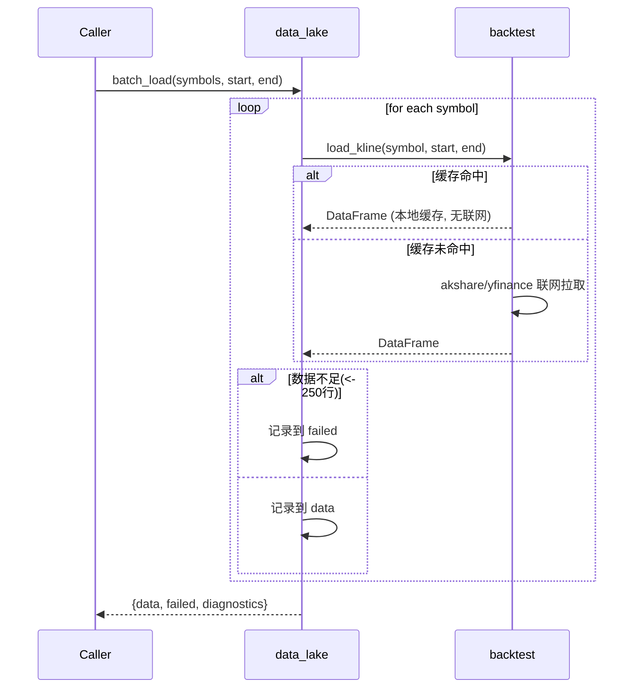

# BE-012 日K数据湖与批量加载 — 实现文档

## 1. 模块位置

`pattern_matching/data_lake.py` 封装 `backtest/data.py::load_kline()`

## 2. 数据结构

### 输入

```python
batch_load(
    symbols: List[str],         # ["sh000300", "600519", ...]
    start: str,                 # "2021-01-01"
    end: str,                   # "2026-06-29"
    adjust: str = "qfq",        # 复权方式
    min_bars: int = 250         # 最少交易日行数
) -> dict
```

### 输出

```json
{
  "ok": true,
  "data": {
    "sh000300": <DataFrame>,
    "600519": <DataFrame>
  },
  "failed": [
    {"symbol": "invalid", "reason": "数据不足(仅50行, 需>=250)"}
  ],
  "diagnostics": {
    "total": 10,
    "success": 9,
    "failed": 1,
    "elapsed_ms": 12345
  }
}
```

### DataFrame 字段（来自 load_kline）

| 列 | 类型 | 说明 |
|----|------|------|
| date | str | "YYYY-MM-DD" |
| open | float | 开盘价（前复权） |
| close | float | 收盘价 |
| high | float | 最高价 |
| low | float | 最低价 |
| volume | float | 成交量 |

## 3. 函数签名

```python
def batch_load(symbols: List[str], start: str, end: str,
               adjust: str = "qfq", min_bars: int = 250) -> Dict
```

## 4. 时序逻辑



## 5. 缓存策略

- 复用 `backtest/data.py` 的 CSV 缓存：`data_cache/{symbol}_{adjust}.csv`
- 同日同一标的不会重复联网
- 距最后缓存日期≥2天时自动增量拉取

## 6. 验收结果

```
批量加载: total=5 success=3 failed=2 elapsed=26110ms
  失败: 600519 - ConnectionError
  失败: invalid_xyz - ConnectionError
  成功: sh000300 rows=725
成功: sh000001 rows=724
  成功: 000001 rows=706
缓存命中: 9ms
```
