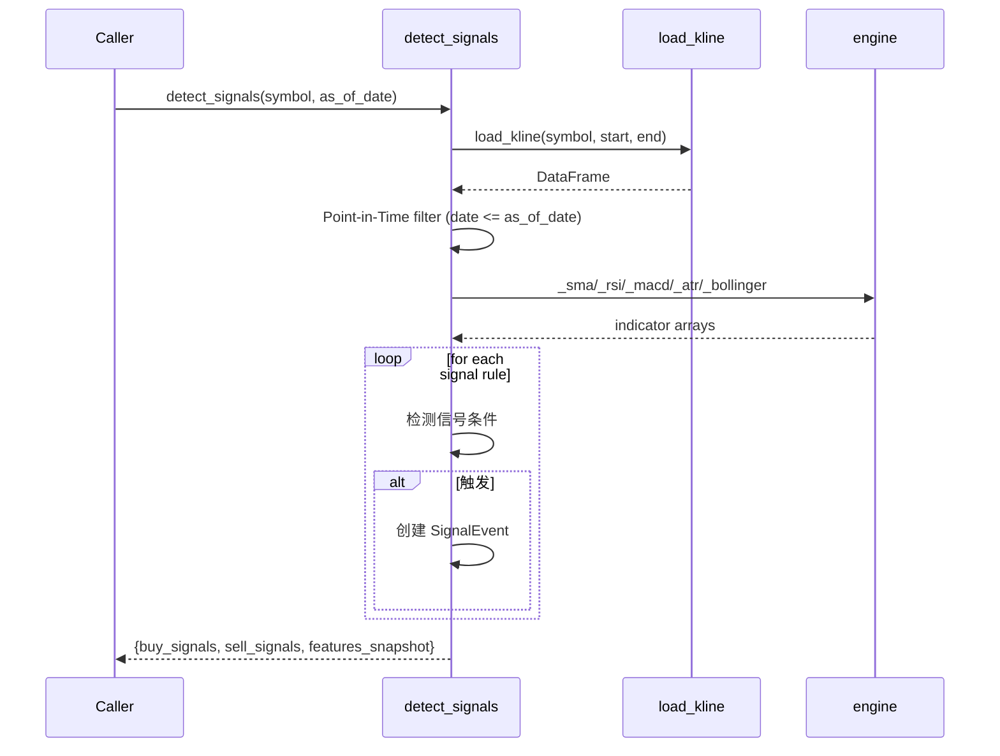

# BE-021 信号侦测引擎 — 实现文档

## 1. 模块位置

`pattern_matching/signals.py`

## 2. 数据结构

### 2.1 信号定义

```python
SIGNAL_DEFINITIONS = {
    "buy": [
        {"type": "breakout_20d",  "label": "收盘突破20日新高",   "strength": 0.7},
        {"type": "breakout_60d",  "label": "收盘突破60日新高",   "strength": 0.85},
        {"type": "breakout_120d", "label": "收盘突破120日新高",  "strength": 0.95},
        {"type": "bb_breakout",   "label": "突破布林带上轨",     "strength": 0.5},
        {"type": "vol_breakout",  "label": "量价突破20日新高",   "strength": 0.75},
        {"type": "ma_golden_20_60","label": "MA20上穿MA60",     "strength": 0.5},
        {"type": "ma_bull_stack", "label": "多头排列初次形成",   "strength": 0.75},
        {"type": "resit_ma20",    "label": "价格重站MA20",       "strength": 0.5},
        {"type": "rsi_oversold",  "label": "RSI低位上穿30",     "strength": 0.3},
        {"type": "vol_reversal",  "label": "连跌后放量阳线",     "strength": 0.5},
    ],
    "sell": [
        {"type": "break_20d_low", "label": "收盘跌破20日新低",   "strength": 0.7},
        {"type": "break_60d_low", "label": "收盘跌破60日新低",   "strength": 0.85},
        {"type": "ma_death_20_60","label": "MA20下穿MA60",      "strength": 0.5},
        {"type": "ma_bear_stack", "label": "空头排列形成",       "strength": 0.75},
        {"type": "rsi_overbought","label": "RSI高位下穿70",     "strength": 0.3},
    ],
}
```

### 2.2 信号事件对象

```json
{
  "type": "breakout_20d",
  "label": "收盘突破20日新高",
  "signal_date": "2026-06-29",
  "strength": 0.7,
  "strength_label": "强",          // 极强(≥0.9)/强(0.7)/中(0.5)/弱(<0.5)
  "market_regime": "RANGE",       // BULL/BEAR/RANGE
  "volatility_regime": "LOW",     // HIGH/MID/LOW
  "volume_confirmation": true,    // 量能确认（部分信号有）
  "signal_age": 0                 // 信号触发天数
}
```

### 2.3 完整分析结果

```json
{
  "ok": true,
  "symbol": "sh000300",
  "as_of_date": "2026-06-29",
  "last_close": 3866.21,
  "market_regime": "RANGE",
  "volatility_regime": "LOW",
  "vol_percentile": 38.5,
  "buy_signals": [
    {"type": "breakout_20d", "label": "收盘突破20日新高", "strength": 0.7, ...}
  ],
  "sell_signals": [],
  "has_signal": true,
  "has_buy_signal": true,
  "features_snapshot": {
    "ma5": 3840.0, "ma20": 3810.0, "rsi14": 63.1,
    "atr14": 45.2, "volatility_20d": 1.18
  },
  "total_bars": 1454
}
```

## 3. 接口

### 3.1 主函数

```python
def detect_signals(symbol: str,
                   as_of_date: str = None,     # 分析日期; None=最新
                   adjust: str = "qfq",        # 复权
                   lookback_years: int = 5) -> dict:
    """
    Point-in-Time: 仅使用 as_of_date 及以前数据
    返回: {ok, symbol, as_of_date, buy_signals[], sell_signals[], ...}
    """
```

### 3.2 内部指标计算

| 函数 | 用途 |
|------|------|
| `_rsi(closes, period=14)` | RSI 指标 |
| `_bollinger(closes, period=20, num_std=2)` | 布林带 (upper, middle, lower) |
| `_volatility(closes, period)` | 滚动波动率 |
| `_market_regime(closes, ma_period=60)` | BULL/BEAR/RANGE 分类 |

## 4. 时序逻辑



## 5. 信号确认原则

- T 日收盘确认信号
- T+1 日可执行交易
- 信号有有效期：入场窗口 N 日
- 超过有效期进入衰减期
- 完全过期后信号失效

## 6. 验收结果

```
BE-021 通过: buy=1 sell=0 regime=RANGE
```
