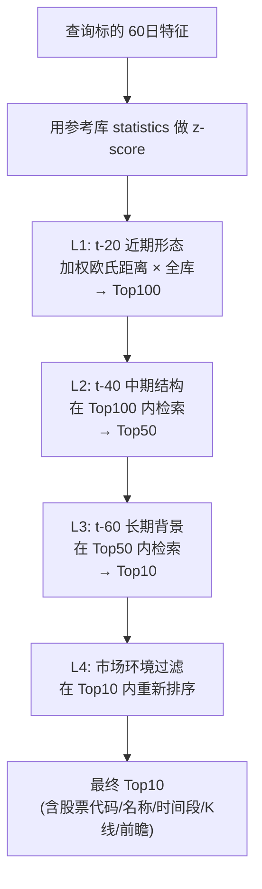
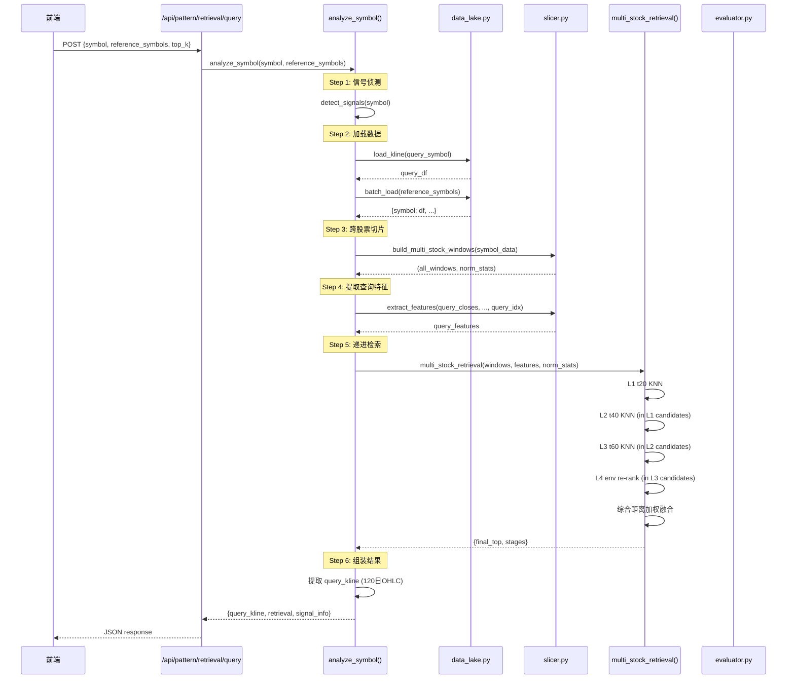

# BE-032 跨股票检索 + BE-033 检索API — 实现文档

## 1. 模块位置

`pattern_matching/retrieval.py` + `app.py` 路由

## 2. 核心算法：四级递进检索



## 3. 数据结构

### 3.1 API 入参

```json
POST /api/pattern/retrieval/query
{
  "symbol": "sh000300",                    // 查询标的
  "as_of_date": "2026-06-29",             // 分析日期, 默认最新
  "adjust": "qfq",                         // 复权方式
  "lookback_years": 6,                     // 历史回溯年数
  "top_k": 10,                             // 返回相似片段数
  "reference_symbols": [                   // 可选: 自定义参考池
    "sh000001", "sz399001", "sz399006", "sh000016", "000001"
  ]
}
```

### 3.2 API 出参

```json
{
  "ok": true,
  "symbol": "sh000300",
  "as_of_date": "2026-06-29",
  "total_stocks": 5,
  "total_windows": 232,

  "signal_info": {
    "ok": true,
    "buy_signals": [{...}],
    "sell_signals": [],
    "market_regime": "RANGE",
    "features_snapshot": {...}
  },

  "query_kline": {
    "dates": ["2025-12-01", ..., "2026-06-29"],
    "ohlc": [[open,close,low,high], ...],     // 120日, ECharts格式
    "volumes": [1234567, ...]
  },

  "retrieval": {
    "ok": true,
    "total_candidates": 232,
    "stages": {
      "t20": {"input": 232, "output": 100},
      "t40": {"input": 100, "output": 50},
      "t60": {"input": 50,  "output": 10},
      "env": {"input": 10,  "output": 5}
    },
    "final_top": [
      {
        "rank": 1,
        "symbol": "sh000001",                // ← 不同股票!
        "anchor_date": "2025-05-06",
        "similarity": 0.510,                  // 0~1
        "combined_distance": 0.959,
        "entry_price": 3310.52,
        "fwd_returns": {
          "r_5d": 0.23,  "r_10d": 1.12,
          "r_20d": 1.80, "r_40d": 3.45, "r_60d": 5.10,
          "max_drawdown": -2.3
        },
        "fwd_path": [0.12, 0.45, 0.89, ...],  // 60日前瞻路径(收益%)
        "kline_ohlc": [[open,close,low,high], ...],  // 前后各60日
        "kline_dates": ["2025-02-01", ...],
        "anchor_offset": 60
      }
    ]
  },
  "diagnostics": {
    "elapsed_ms": 3421,
    "reference_stocks": 5,
    "total_windows": 232
  }
}
```

## 4. 内部函数接口

### 4.1 主入口

```python
def analyze_symbol(symbol: str,
                   as_of_date: str = None,
                   adjust: str = "qfq",
                   lookback_years: int = 6,
                   top_k: int = 10,
                   reference_symbols: list = None,
                   ref_limit: int = 50) -> dict:
```

**流程：**
1. 信号侦测 query stock
2. 加载 query stock 完整历史
3. 加载 reference pool 各股票历史
4. 跨股票构建片段库（build_multi_stock_windows）
5. 提取 query 标的特征
6. 提取 query 标的近120日K线
7. 执行多股票递进检索（multi_stock_retrieval）

### 4.2 递进检索核心

```python
def multi_stock_retrieval(windows: list,
                          q_features: dict,
                          norm_stats: tuple,
                          top_k: int = 10) -> dict:
```

**权重配置：**

| 层 | 权重数组 | 距离算法 |
|----|----------|----------|
| t20 | [1.0, 1.0, 1.0, 0.8, 1.2, 0.8] | 加权欧氏 |
| t40 | [1.0, 1.2, 1.0, 0.8, 0.8] | 加权欧氏 |
| t60 | [1.0, 0.8, 1.0, 1.2, 1.0] | 加权欧氏 |
| env | [1.0, 0.8, 1.2] | 加权欧氏 |

**综合得分融合：** `0.25×t20_dist + 0.25×t40_dist + 0.30×t60_dist + 0.20×env_dist`

### 4.3 KNN 搜索

```python
def _wnn(query_vec, candidates, k, weights):
    """
    candidates: [(idx, vector_list), ...]
    返回: [(idx, distance, similarity_score), ...]
    similarity_score = 1 / (1 + distance)
    """
```

## 5. 时序逻辑（完整请求链路）



## 6. 部署位置

| 组件 | 文件 | 行数 |
|------|------|------|
| 主入口 | `retrieval.py::analyze_symbol()` | ~200 |
| 递进检索 | `retrieval.py::multi_stock_retrieval()` | ~50 |
| KNN 搜索 | `retrieval.py::_wnn()` | ~10 |
| 距离计算 | `retrieval.py::_weighted_euclidean()` | ~5 |
| API 路由 | `app.py::api_retrieval_query()` | ~25 |

## 7. 验收结果

```
stocks: 4
wins: 232
top_count: 5
top_symbols: sh000001 sh000300    ← 跨2个不同标的
has_kline: True
```
