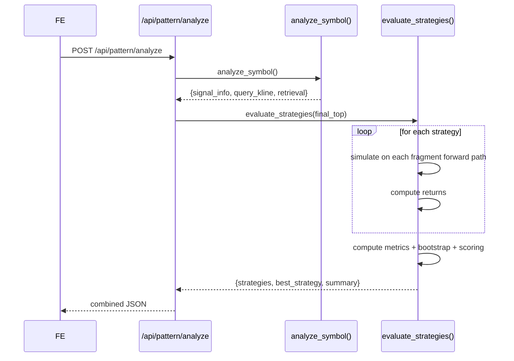

# BE-040 策略库 + BE-041 策略评估 + BE-042 评估API — 实现文档

## 1. 模块位置

`pattern_matching/evaluator.py` + `app.py` 路由

## 2. 策略库（BE-040）

### 2.1 策略清单

| ID | 名称 | 类别 | 持仓日 | 出场方式 |
|----|------|------|--------|----------|
| DIR-5 | 信号后持有5日 | direct | 5 | 固定到期 |
| DIR-10 | 信号后持有10日 | direct | 10 | 固定到期 |
| DIR-20 | 信号后持有20日 | direct | 20 | 固定到期 |
| DIR-60 | 信号后持有60日 | direct | 60 | 固定到期 |
| SL-5 | 持有20日+5%止损 | risk | 20 | 5%止损 |
| SL-8 | 持有20日+8%止损 | risk | 20 | 8%止损 |
| TRAIL-5 | 持有20日+5%移动止盈 | risk | 20 | 5%回撤止盈 |
| TRAIL-10 | 持有40日+10%移动止盈 | risk | 40 | 10%回撤止盈 |
| TIME-10 | 持有至10日不涨即出 | risk | 10 | 时间止损 |
| BUYHOLD-60 | 基准：买入持有60日 | benchmark | 60 | 固定到期 |

### 2.2 策略数据结构

```python
{
    "id": "DIR-20",
    "name": "信号后持有20日",
    "category": "direct",       # direct / risk / benchmark
    "holding_days": 20,
    "entry": "signal_next_open",# 入场规则
    "exit": "fixed_days",       # 出场规则
    "params": {"days": 20}      # 参数
}
```

## 3. 评估引擎（BE-041）

### 3.1 函数签名

```python
def evaluate_strategies(fragments: list) -> dict:
    """
    fragments: list of {fwd_path, fwd_returns, entry_price, anchor_date, similarity}

    返回: {strategies[], best_strategy, summary, strategy_count}
    """
```

### 3.2 评估流程

```
对每个候选策略:
  对每个相似片段:
    模拟按策略入场后的逐日走势
    → 按出场规则决定退出日和收益
  汇总所有片段的收益样本
  → 计算 16 项评估指标
  → Bootstrap 1000次计算95% CI
  → 多目标稳健评分
  → 置信度标注

按稳健评分降序排列
```

### 3.3 评估指标（16项）

| 指标 | 计算方式 |
|------|----------|
| mean_return | mean(returns) |
| median_return | median(returns) |
| win_rate | count(>0)/N |
| profit_loss_ratio | avg_win/avg_loss |
| max_single_loss | min(returns) |
| worst_quantile_20 | percentile(returns, 20) |
| max_drawdown | max_drawdown of equity curve |
| sharpe | mean/std × sqrt(252/avg_hold) |
| calmar | median/abs(max_drawdown) |
| avg_holding_days | mean(holding_days) |
| bootstrap_lower | 2.5th percentile of bootstrap means |
| bootstrap_upper | 97.5th percentile of bootstrap means |
| skewness | skewness(returns) |
| kurtosis | kurtosis(returns) |
| robust_score | 见 3.4 |
| confidence | LOW(<30)/MED(30-100)/HIGH(>100) |

### 3.4 稳健评分公式

```
综合评分 =
  中位数收益 × 25%    (绝对值评分: median/100×2, clamp[-1,1])
+ 胜率 × 20%          ((win_rate-50)/50, clamp[-1,1])
+ 盈亏比 × 15%        ((pl_ratio-1)/2, clamp[-1,1])
+ 最差20%分位 × 20%   (worst_q20/100×5, clamp[-1,1])
+ 卡玛比率 × 10%      (calmar/2, clamp[-1,1])
+ Bootstrap稳定性×10%  (CI下界>0 → 1.0, else 0.3)
- 样本不足惩罚 (<30:-0.5, 30-100:-0.2, >100:0)
- 复杂度惩罚 (非benchmark:-0.05)
```

### 3.5 评估结果数据结构

```json
{
  "ok": true,
  "strategies": [
    {
      "strategy_id": "DIR-60",
      "strategy_name": "信号后持有60日",
      "category": "direct",
      "sample_count": 10,
      "median_return": 2.38,
      "win_rate": 70.0,
      "worst_quantile_20": -3.2,
      "max_drawdown": -5.1,
      "sharpe": 0.85,
      "calmar": 0.47,
      "bootstrap_lower": -1.2,
      "bootstrap_upper": 5.8,
      "robust_score": -0.1895,
      "confidence": "LOW",
      "confidence_note": "样本不足30，置信度低，仅供参考",
      "returns": [1.5, -0.3, 2.1, ...]
    }
  ],
  "best_strategy": {...},
  "summary": {
    "sample_count": 10,
    "buy_hold_stats": {
      "r_20d": {"mean": 0.51, "median": 0.30, "win_rate": 60.0}
    }
  }
}
```

## 4. API 端点（BE-042）

### 4.1 完整分析

```http
POST /api/pattern/analyze
{
  "symbol": "sh000300",
  "reference_symbols": ["sh000001", "sz399001"],
  "top_k": 10,
  "lookback_years": 6
}
```

**响应：** 包含 `signal_info` + `query_kline` + `retrieval` + `strategy_eval`

### 4.2 仅检索

```http
POST /api/pattern/retrieval/query
{...}
```

## 5. 时序逻辑


