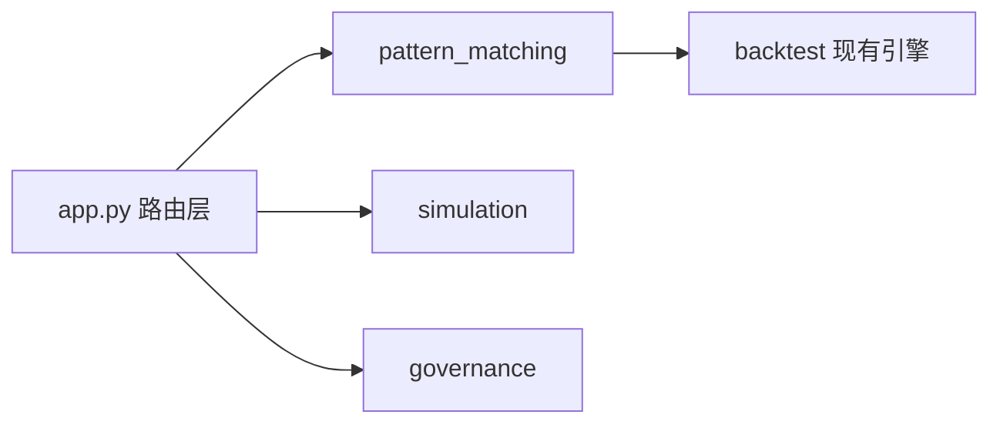

# BE-000 项目模块骨架整理

- **类型**：后端/工程
- **优先级**：P0
- **状态**：已完成 ✅

---

## 1. 需求目标

建立与总体设计一致的模块边界，避免把实验逻辑继续堆进 `app.py`。

## 2. 需求范围

- 新增 `pattern_matching/`、`simulation/`、`governance/` 三组模块
- `app.py` 仅保留路由、任务入口、兼容旧接口
- 保留现有 `backtest/` 能力不破坏

## 3. 依赖关系

- 无

## 4. 示例图 / 流程图



## 6. 数据结构示例

```text
pattern_matching/
  features.py
  signals.py
  slicer.py
  retrieval.py
  evaluator.py
simulation/
  time_gate.py
  wf_engine.py
  rebalance.py
  reporter.py
governance/
  tracking.py
  drift_monitor.py
  lifecycle.py
```

## 7. 验收标准

- [x] 所有新增模块可 `import`
- [x] 旧页面和旧 API 冒烟测试通过
- [x] `app.py` 新增逻辑不超过路由和调度入口
