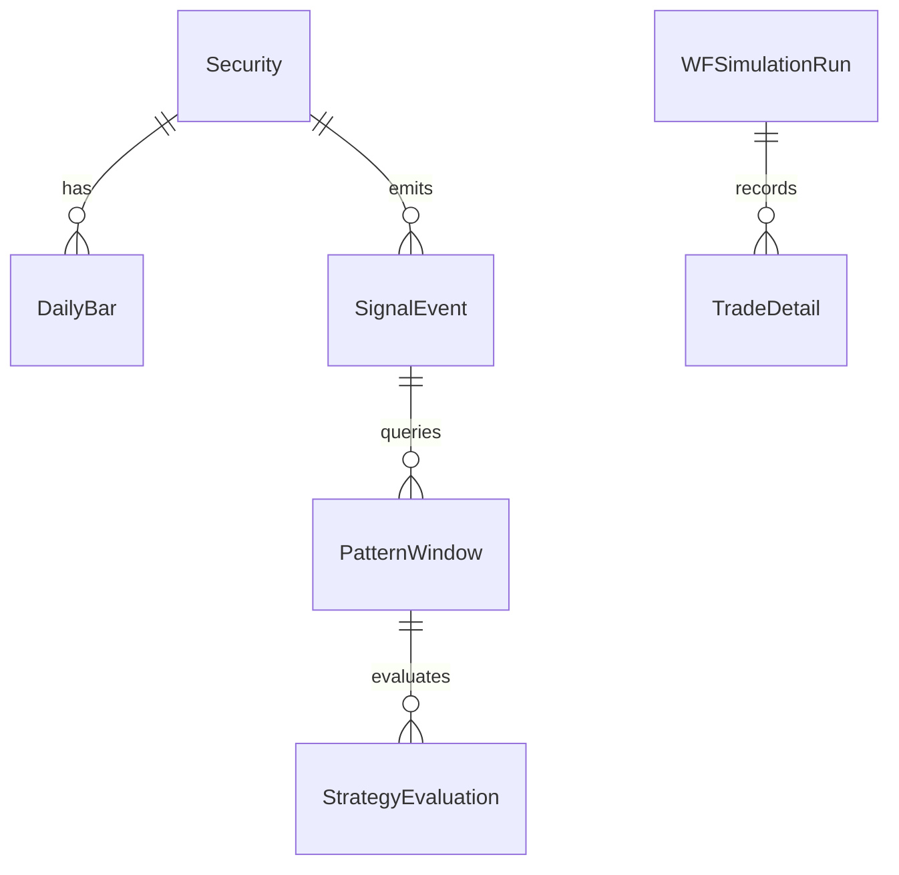

# BE-001 业务对象与数据模型

- **类型**：后端/模型
- **优先级**：P0
- **状态**：已完成 ✅

---

## 1. 需求目标

统一系统核心实体，保证 API、缓存、报告使用同一套字段。

## 2. 需求范围

- 定义证券、日K、特征、信号、片段、策略、模拟运行、交易明细、组合快照
- 先用 dataclass/TypedDict，后续可映射到数据库表
- 字段对齐总体设计第 7 章

## 3. 依赖关系

- `BE-000`

## 4. 示例图 / 流程图



## 6. 数据结构示例

```json
{
  "symbol": "600519",
  "name": "贵州茅台",
  "signal_event": {
    "event_id": "sig_600519_20260629_breakout20",
    "signal_date": "2026-06-29",
    "signal_type": "breakout_20d_high",
    "direction": "buy"
  }
}
```

## 7. 验收标准

- [x] 字段可 JSON 序列化
- [x] 对象字段覆盖第 7 章核心表
- [x] 对象命名在前后端文档中一致
