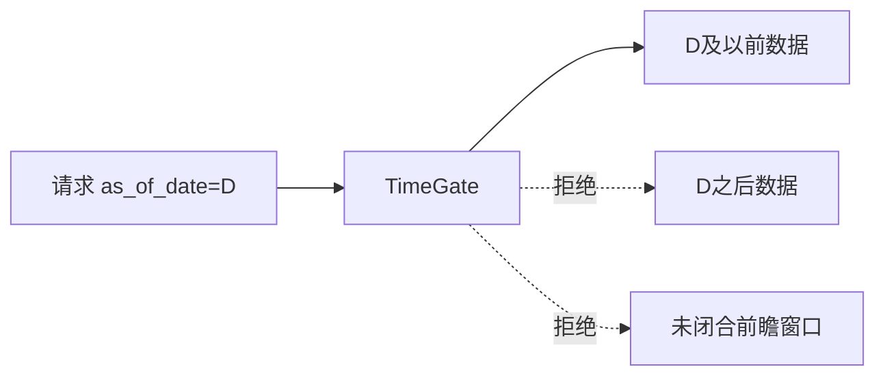

# BE-002 Point-in-Time 时间门控

- **类型**：后端/质量
- **优先级**：P0
- **状态**：已完成 ✅

---

## 1. 需求目标

保证任意模拟日 D 只能访问 D 及以前数据，避免未来函数。

## 2. 需求范围

- 实现 `as_of_date` 过滤
- 前瞻窗口完整性校验：`anchor_date + forward_days <= as_of_date`
- 提供泄漏检查函数和测试 fixture

## 3. 依赖关系

- `BE-001`

## 4. 示例图 / 流程图



## 5. API / 函数设计

```python
class TimeGate:
    def bars(self, symbol: str, as_of_date: str) -> DataFrame: ...
    def visible_windows(self, windows, as_of_date: str, forward_days: int): ...
    def assert_no_future_data(self, payload): ...
```

## 7. 验收标准

- [ ] D+1 数据进入结果时测试失败
- [ ] 未闭合片段不可参与检索和评估
- [ ] API 返回结果包含 `as_of_date`
