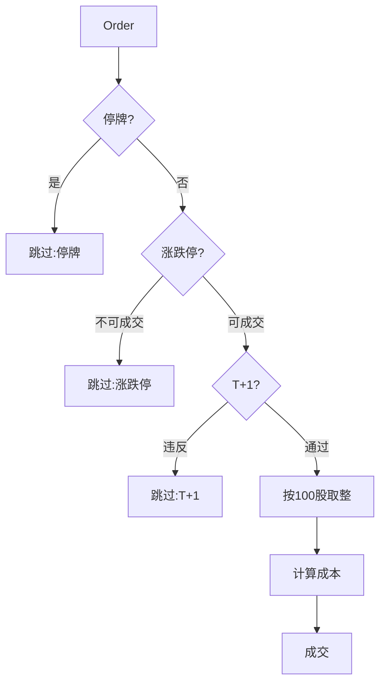

# BE-003 A股交易约束实现

- **类型**：后端/交易模拟
- **优先级**：P0
- **状态**：待办

---

## 1. 需求目标

实现 Walk-Forward 和组合模拟所需的 A 股交易约束。

## 2. 需求范围

- T+1
- 整数手
- 涨跌停
- 停牌
- 佣金/印花税/滑点

## 3. 依赖关系

- `BE-001`
- `BE-002`

## 4. 示例图 / 流程图



## 6. 数据结构示例

```json
{
  "side": "buy",
  "symbol": "600519",
  "requested_qty": 1234,
  "executed_qty": 1200,
  "skipped": false,
  "cost": {"commission": 12.3, "slippage": 49.2}
}
```

## 7. 验收标准

- [ ] 涨停无法买入
- [ ] 跌停无法卖出
- [ ] 当日买入不可当日卖出
- [ ] 买入股数按 100 股取整
