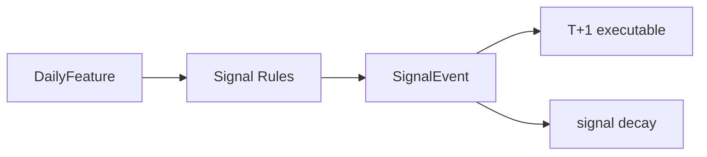

# BE-021 独立信号事件引擎

- **类型**：后端/算法
- **优先级**：P2
- **状态**：待办

---

## 1. 需求目标

把当前扫描逻辑升级为可审计的信号事件。

## 2. 需求范围

- 实现趋势突破/均线结构/超跌反弹/回踩确认/技术反转/风控信号
- 输出信号强度、生命周期、有效期、衰减
- 关联特征快照

## 3. 依赖关系

- `BE-020`
- `BE-002`

## 4. 示例图 / 流程图



## 6. 数据结构示例

```json
{
  "event_id":"sig_600519_20260629_breakout20",
  "symbol":"600519",
  "signal_date":"2026-06-29",
  "signal_type":"breakout_20d_high",
  "direction":"buy",
  "strength":0.7,
  "valid_next_trade_date":"2026-06-30"
}
```

## 7. 验收标准

- [ ] 每条信号有触发条件说明
- [ ] 确认日和执行日分离
- [ ] 信号可按有效期和衰减状态查询
