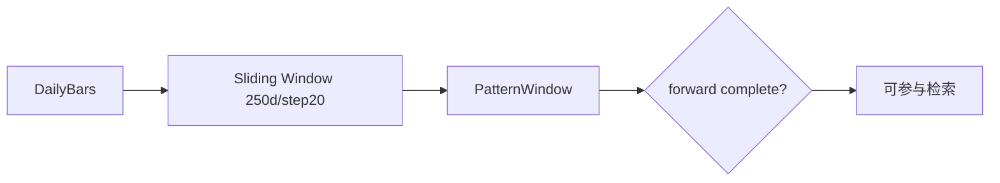

# BE-030 K线片段切片器

- **类型**：后端/算法
- **优先级**：P3
- **状态**：待办

---

## 1. 需求目标

对参考池全部股票切出可检索历史片段。

## 2. 需求范围

- 250日窗口、20日步长
- 每段记录 symbol/name/anchor_date/lookback/forward
- 保存前后 K 线数据或可按 window_id 回查
- 标记前瞻窗口是否闭合

## 3. 依赖关系

- `BE-012`
- `BE-020`
- `BE-002`

## 4. 示例图 / 流程图



## 6. 数据结构示例

```json
{
  "window_id":"win_600519_2024-03-15_250_60",
  "symbol":"600519",
  "name":"贵州茅台",
  "anchor_date":"2024-03-15",
  "lookback_days":250,
  "forward_days":60,
  "is_forward_window_complete":true
}
```

## 7. 验收标准

- [ ] 片段必须带 symbol/name
- [ ] 可按 as_of_date 过滤未闭合片段
- [ ] 同一股票可产生多段片段
