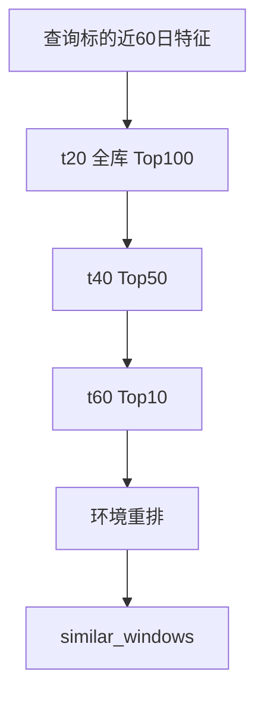

# BE-032 跨股票逐级递进检索

- **类型**：后端/算法
- **优先级**：P3
- **状态**：待办

---

## 1. 需求目标

在整个参考池片段库中找相似片段，不能只找自身历史。

## 2. 需求范围

- t20: 全库→Top100
- t40: Top100→Top50
- t60: Top50→Top10
- env: Top10重排
- 输出每个相似片段的股票代码/名称/时间段/K线/前瞻走势

## 3. 依赖关系

- `BE-031`
- `BE-010`

## 4. 示例图 / 流程图



## 6. 数据结构示例

```json
{
  "rank":1,
  "symbol":"600519",
  "name":"贵州茅台",
  "similar_period":"2024-01-02 ~ 2024-03-15",
  "anchor_date":"2024-03-15",
  "similarity":0.873,
  "stage_scores":{"t20":0.91,"t40":0.84,"t60":0.80,"env":0.75}
}
```

## 7. 验收标准

- [ ] 默认跨参考池检索，结果可包含不同 symbol
- [ ] 结果必须列股票代码/名称/相似时间段
- [ ] 每层候选数和分数可追溯
