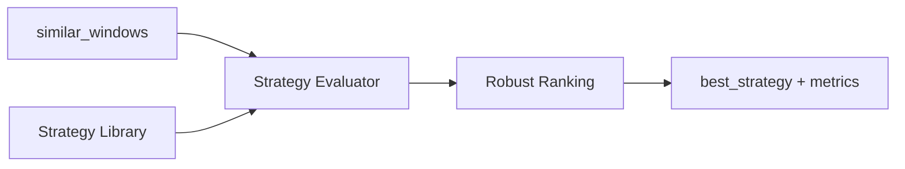

# BE-042 策略评估 API

- **类型**：后端
- **优先级**：P4
- **状态**：待办

---

## 1. 需求目标

向前端返回策略评估指标、最佳策略和收益分布。

## 2. 需求范围

- 直接入场 DIR-5/10/20
- 确认入场 CON-UP/CON-NB/CON-VOL
- 回踩入场 PB-MA10/PB-BO/PB-COOL
- 风控 SL/ATR/TIME/TRAIL
- 输出样本数、胜率、中位数、尾部风险、Bootstrap

## 3. 依赖关系

- `BE-041`

## 4. 示例图 / 流程图



## 6. 数据结构示例

```json
{
  "strategy_id":"DIR-20",
  "sample_count":42,
  "median_return":3.2,
  "win_rate":61.9,
  "worst_quantile_20":-4.8,
  "robust_score":0.62,
  "confidence":"MED"
}
```

## 7. 验收标准

- [ ] 样本数<30必须低置信度
- [ ] 不能只按平均收益排序
- [ ] 每个策略有版本号和可解释规则
