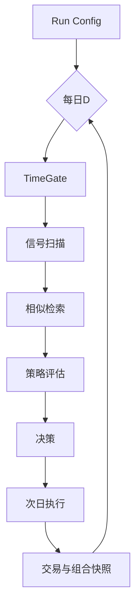

# BE-051 时间门控逐日模拟引擎

- **类型**：后端
- **优先级**：P5
- **状态**：待办

---

## 1. 需求目标

逐日复制真实决策流程，严格只使用当日可见信息。

## 2. 需求范围

- 配置起止日期/交易池/参考池/仓位/成本
- 逐日扫描信号/检索/评估/决策/执行
- 记录 trade_details、portfolio_snapshots、decision_logs

## 3. 依赖关系

- `BE-022`
- `BE-033`
- `BE-042`
- `BE-050`

## 4. 示例图 / 流程图

## 7. 验收标准

- [ ] 每个模拟日决策可复现
- [ ] 每笔交易可追溯至信号/检索/策略
- [ ] 空仓是合法动作
