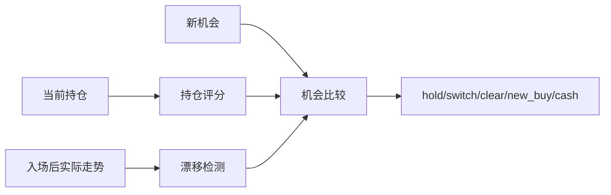

# BE-062 再平衡决策引擎

- **类型**：后端
- **优先级**：P6
- **状态**：待办

---

## 1. 需求目标

在持仓、新机会、现金之间生成 hold/switch/clear/new_buy/cash 决策。

## 2. 需求范围

- 计算 hold_score
- 计算形态漂移/机会成本/换手成本
- 输出风险动作和决策原因

## 3. 依赖关系

- `BE-060`
- `BE-061`
- `BE-003`

## 4. 示例图 / 流程图

## 7. 验收标准

- [ ] 每个动作有可解释 reason
- [ ] 换仓必须覆盖成本阈值
- [ ] 现金是合法选择
