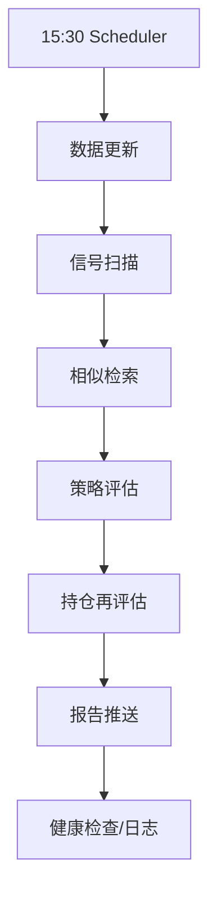

# OPS-071 盘后报告推送

- **类型**：生产化
- **优先级**：P7
- **状态**：待办

---

## 1. 需求目标

复用现有 Webhook/邮箱推送每日信号与持仓建议。

## 2. 需求范围

- 任务编排
- 异常捕获
- 结果落库/缓存
- 健康检查
- 前后端日志

## 3. 依赖关系

- `OPS-070`

## 4. 示例图 / 流程图

## 7. 验收标准

- [ ] 任务失败不会静默
- [ ] 日志包含 query_id/耗时/结果数
- [ ] 健康接口可返回最近运行状态
