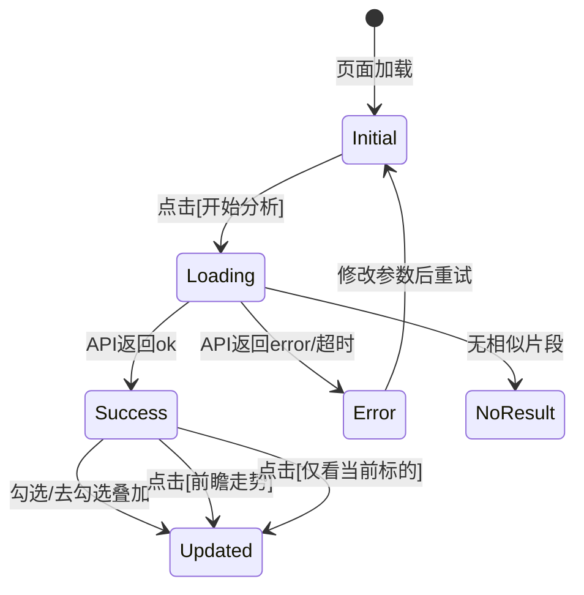

# FE-030 相似K线研究页 MVP — 实现文档

## 1. 页面布局

```
+-------------------------------------------------------------------+
| 顶栏: 相似K线策略研究                    [返回]                      |
+-------------------------------------------------------------------+
| 配置栏:                                                           |
| 标的[symbol] 日期[date] 参考标的[ref1,ref2] 回溯[years] 相似数[k]   |
| [开始分析] [仅看当前标的]                                          |
+-------------------------------------------------------------------+
| 日志面板 (可收起): [14:01:02] 请求已发送... [14:01:05] 返回5条     |
+------------------------------------------------+------------------+
| K线主图 (Canvas 600x450)                       | 相似片段列表     |
|                                                | [x] sh000001     |
|  绿色实体=当前标的K线(锚点对齐到最右)            |  相似度 51.0%   |
|  半透明彩色=相似片段K线                          |  锚定日 2025-05  |
|  虚线=相似片段前瞻走势                           |  5d +0.2%       |
|                                                |  10d +1.1%      |
|                                                |  20d +1.8%      |
|                                                |  [前瞻走势]     |
|                                                | [x] sz399001    |
|                                                |  ...            |
+------------------------------------------------+------------------+
| 检索链路: t20 232→100 / t40 100→50 / t60 50→10 / env重排          |
+-------------------------------------------------------------------+
| [策略评估] (折叠面板)                                              |
| 排名|策略|样本|中位数|胜率|回撤|夏普|卡玛|评分|置信度              |
+-------------------------------------------------------------------+
```

## 2. 组件树

```
Page
├── Topbar (标题 + 返回链接)
├── ConfigBar
│   ├── SymbolInput (标的代码)
│   ├── DateInput (分析日期)
│   ├── RefInput (参考标的, 逗号分隔)
│   ├── LookbackInput (回溯年数)
│   ├── TopKInput (相似片段数)
│   ├── AnalyzeButton (onclick="analyze()")
│   └── ShowOnlyMeButton (隐藏所有相似)
├── LogPanel (收起/展开, 滚动)
├── MainArea (flex row)
│   ├── KlineChart (Canvas 600x450)
│   │   ├── 当前标的K线 (绿色实体蜡烛)
│   │   ├── 相似片段K线 (半透明蜡烛)
│   │   ├── 锚点分割线 (黄色虚线)
│   │   └── 前瞻走势 (虚线)
│   └── SimList (右侧面板)
│       ├── PipelineBar (检索链路摘要)
│       └── SimItem[] (for each fragment)
│           ├── SimHead (排名 + 股票代码/名称 + 相似度)
│           ├── SimDate (锚定日 + 入场价)
│           ├── SimReturns (5/10/20日收益)
│           ├── ToggleCheckbox (叠加显示)
│           └── FwdButton (前瞻走势)
└── EvalPanel (折叠)
    └── EvalTable (策略排名表)
```

## 3. 交互逻辑



## 4. 状态管理

```javascript
state = {
    loading: false,           // 请求中 → 禁用按钮
    currentData: null,        // API 返回全量数据
    queryKline: null,         // 当前标的K线
    similarFragments: [],     // 相似片段列表
    visibleMap: {},           // {fragmentIndex: checkbox.checked}
    fwdMap: {},               // {fragmentIndex: showing_forward}
    showOnlyMe: false,        // 仅显示当前标的
    strategyEval: null,       // 策略评估结果
}
```

## 5. Canvas K线图渲染逻辑

```
drawKline(canvas, queryKline, similarFragments, visibleMap, fwdMap, showOnlyMe):
    1. 清空画布
    2. 计算价格范围 (包含所有可见K线 + 前瞻走势)
    3. 画网格线
    4. 画当前标的K线 (绿涨红跌实体蜡烛, 锚点日=最右)
    5. for each fragment in similarFragments:
       if visibleMap[i] and !showOnlyMe:
         画相似片段K线 (锚点对齐到最右, 半透明)
       if fwdMap[i]:
         画前瞻走势 (虚线折线)
    6. 画锚点分割线
    7. 画图例
```

## 6. Canvas 数据映射

```
画布坐标系:
  x: 时间索引 (0~119, 最右=锚点日)
  y: 价格 (top=最高价, bottom=最低价)

K线实体:
  barWidth = canvas.width / (N + 1)
  for each day i:
    if close >= open: 绿色实体 (open→close)
    else: 红色实体 (close→open)
    wick: high→low 细线

对齐逻辑:
  queryKline: N条数据, 最右=锚点日, x = i * barWidth
  fragmentKline: M条数据, anchor_offset 指向锚点日
    → 锚点日 x = (N-1) * barWidth
    → 片段起始 x = (N-1 - anchor_offset) * barWidth
```

## 7. 验收标准
