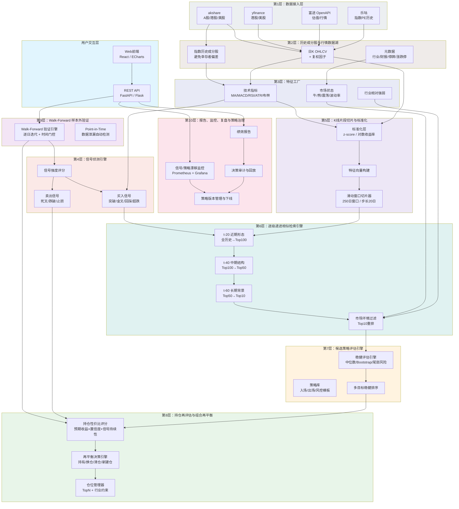
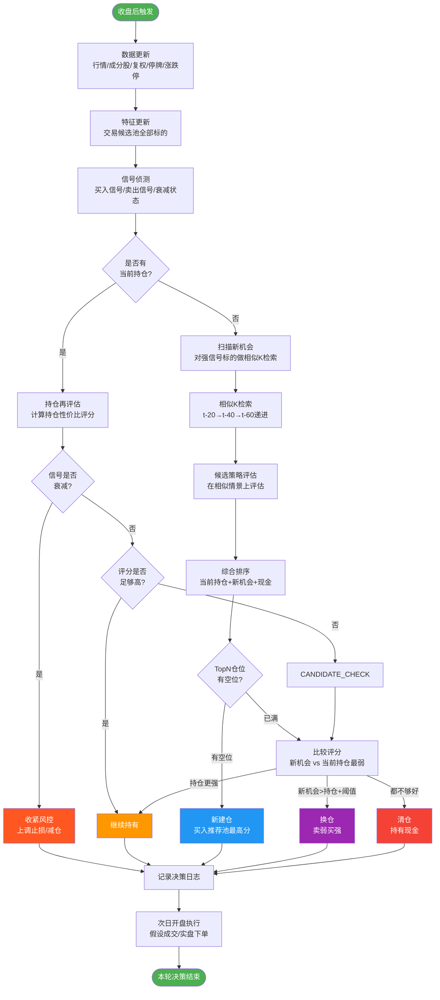
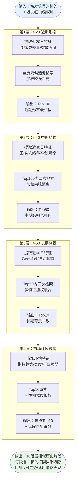
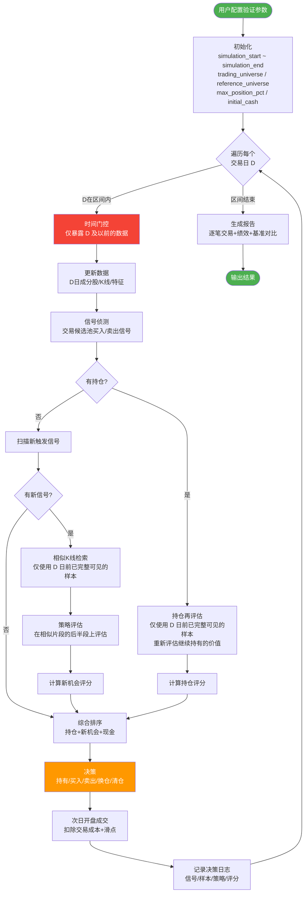
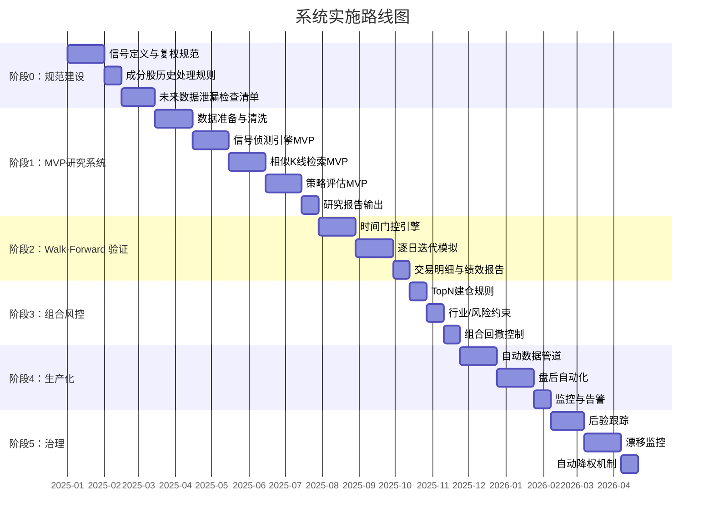

# 指数成分股动态相似K线策略系统——总体设计

> 版本：v2.0
> 基准市场：中证A500成分股；可扩展至标普500、沪深300、中证1000等
> 定位：情景化量化研究与交易决策辅助系统
> 现有资产：Flask 回测平台 + trade-notify 信号侦测（`app.py` / `backtest/`）

---

## 0. 概述

本系统为**日频盘后动态决策系统**：每日基于最新K线、信号事件、相似历史情景、候选策略表现、当前持仓性价比及仓位约束，判定：

```text
继续持有 / 换仓 / 新建仓 / 清仓 / 持有现金
```

核心问题并非"寻找买点"，而是：

> 当前持仓继续持有的期望效用，是否仍然优于换仓或空仓？

Walk-Forward 样本外验证必须严格复制此逐日迭代逻辑，以检验系统在真实时间序列下的有效性。

---

## 1. 系统目标

系统由四项核心能力构成：

1. **日频盘后信号侦测**
   针对交易候选池，扫描日K线买入/卖出信号事件（突破、金叉、回踩确认等）。

2. **逐级递进相似K线检索**
   对触发强信号的标的，在历史片段库中执行 t-20 → t-40 → t-60 级联检索，逐层收缩候选集。

3. **相似情景下策略评估与排序**
   在与当前走势最相似的历史片段上，评估候选入场/持有/退出策略，基于中位数收益、胜率、回撤、尾部风险、样本数及稳定性进行稳健排序。

4. **Walk-Forward 样本外验证（Point-in-Time 模拟）**
   用户指定历史区间（如 2020-01-01 至 2023-01-01），系统在每个模拟日仅使用该日及之前的数据，逐日执行完整决策流程，输出逐笔交易明细及全区间绩效报告。

---

## 2. 设计约束

系统受四条核心约束：

```text
交易候选池 →  可交易标的集合
研究参考池 →  可学习样本集合
信息截止日 →  当前可见信息边界
仓位上限   →  最大持仓集中度
```

### 2.1 交易候选池

交易候选池定义系统允许实际买卖的标的集合。

例：用户从中证A500成分股中指定10只标的，则系统仅可：

- 扫描该10只标的的交易信号；
- 买入该10只标的；
- 对该10只标的执行卖出、减仓、持有或换仓操作；
- 不得买入研究参考池中但不在交易候选池内的标的。

### 2.2 研究参考池

研究参考池用于相似K线检索、胜率统计与策略评估，默认建议中证A500历史成分股，可扩展至沪深300、中证1000、标普500历史成分股或用户自定义池。

约束：

- 在信息截止日 D，仅可使用 D 之前已完整可见的历史样本。
- 若某样本需未来 N 个交易日计算策略结果，其完整评估窗口须在 D 之前已闭合。
- 禁止使用未来收益、未来最大回撤或未来胜率辅助当前决策。

### 2.3 信息截止日（Point-in-Time Cutoff）

信息截止日 D 严格界定当前可见信息边界。在模拟日 D：

- D 之后的 K 线不可见；
- D 之后的信号事件不可见；
- D 之后的财报、成分股变动、行业表现不可见；
- D 之后才完成评估的策略标签不可用。

### 2.4 仓位约束

单标的仓位上限可由用户配置：

```text
max_positions = floor(100% / max_position_pct)
```

| 单标的最大仓位 | 最大持仓数 | 每日推荐池数量 |
|---:|---:|---:|
| 5% | 20 | Top20 |
| 10% | 10 | Top10 |
| 20% | 5 | Top5 |
| 25% | 4 | Top4 |

示例：`max_position_pct = 10%` 时，系统最多并行持有 10 个仓位，每日从推荐池中选取 Top10 建仓或维持。

---

## 3. 系统总体架构

### 3.1 十层架构全景图



### 3.2 模块功能详细说明

#### 第1层：数据接入层

需要接入的数据及对应的现有实现：

| 数据 | 用途 | 优先级 | 现有实现 |
|---|---|---|---|
| 指数历史成分股 | 避免幸存者偏差 | 关键 | `backtest/scanner.py` → `get_a500_constituents()` |
| 个股日K OHLCV | 信号、相似检索、策略评估 | 关键 | `backtest/data.py` → `load_kline()` |
| 复权因子/分红送转 | 保证价格连续性 | 关键 | akshare `adjust='qfq'` 前复权 |
| 指数行情 | 市场环境过滤、基准对比 | 重要 | 同上 |
| PE估值历史 | 仓位管理、估值分位 | 重要 | `load_pe()` / `load_valuation_pe()` |
| 行业/主题分类 | 行业相对强弱 | 重要 | 待建设 |
| 市场宽度 | 判断整体风险偏好 | 重要 | 待建设 |
| 财报日期 | 避免财报事件扰动 | 一般 | 待建设 |
| 停牌/涨跌停数据 | A股交易可行性 | 重要 | 待建设 |
| 新闻/公告标签 | 后续增强 | 一般 | 待建设 |

#### 第2层：历史成分股与行情数据湖

**职责**：存储全量历史数据，支撑特征计算与相似检索。

**核心表结构**：

- `daily_bars`：日K OHLCV + 复权价 + 停牌/涨跌停标记。每一行对应一只标的在一个交易日的数据，是整个系统的数据基石。
- `index_membership`：记录标的历史指数归属关系，是防止幸存者偏差的关键——禁止以当前成分股回测历史区间。
- `daily_features`：预计算的特征快照，避免每次查询重复计算技术指标。

**存储方案**：

| 阶段 | 方案 | 说明 |
|---|---|---|
| MVP | Parquet 分区文件 | 按 symbol+year 分区，DuckDB 查询 |
| 生产 | PostgreSQL + TimescaleDB + Parquet数据湖 | 结构化元数据走PG，大规模行情走Parquet |
| 扩展 | ClickHouse | 样本量百万级以上的分析加速 |

#### 第3层：特征工厂

**职责**：将原始 OHLCV 数据转化为标准化特征，供信号引擎和相似检索使用。

**特征分类**：

| 特征组 | 指标 | 计算窗口 |
|---|---|---|
| 收益特征 | 1d/5d/20d/60d 收益率 | 滚动 |
| 波动特征 | 20d/60d 波动率、ATR(14) | 滚动 |
| 趋势特征 | MA20/MA60、MA斜率、距均线距离 | 滚动 |
| 量能特征 | 成交量z-score、量比、缩量/放量标记 | 滚动 |
| 形态特征 | 最近N日高低点、平台检测 | 滚动 |
| 市场状态 | 牛/熊/震荡分类、波动率分位 | 滚动 |

#### 第4层：信号侦测引擎

**职责**：在交易候选池中扫描买入/卖出信号事件。

**信号生命周期**：

```text
信号触发日(close确认) → 信号有效期(N日) → 衰减期 → 信号失效
```

每个信号具有以下关键属性：

- **确认日**：收盘价确认信号的日期（`signal_date`）
- **执行日**：下一交易日（`valid_next_trade_date`，T+1保证）
- **方向**：buy（买入）/ sell（卖出）/ risk_off（减仓）
- **强度**：信号本身的置信程度
- **衰减**：信号随时间的衰减速度

**信号与现有代码的关系**：

当前 `app.py` 的信号侦测（`scan_symbol()` / `trade-notify`）使用了5种入场+5种出场策略的组合信号。本系统将信号体系升级为更细粒度的独立信号事件，每个信号可独立追踪生命周期。

#### 第5层：K线片段切片与标准化

**职责**：将历史 K 线数据切分为标准化片段（pattern windows），构建相似检索候选库。

**切片策略**：

```
滑动窗口：250个交易日
滑动步长：20个交易日（约1个月）
标准化：对数收益率 + z-score归一化
```

**设计依据——为何使用对数收益率而非原始价格**：

- 对数收益率消除不同价位标的的量纲差异（茅台 1800 元与银行股 5 元不可直接比较）
- z-score 归一化消除波动率量纲差异
- 标准化后可直接使用欧氏距离/余弦距离

#### 第6层：逐级递进相似检索引擎

**职责**：对触发信号的标的，在历史片段库中执行三级递进检索，输出最相似的 Top10 片段。

**设计依据**：将 20/40/60 日特征拼接为单一高维向量的方案存在三方面缺陷：
1. 长窗口特征会稀释短期强信号的判别力；
2. 不同周期的特征权重缺乏可解释性；
3. 最终样本的选取逻辑难以追溯。

逐级递进策略提供了明确的可解释链条：

```text
先匹配近期形态(t-20)，再匹配中期结构(t-40)，最后确认长期背景(t-60)一致
```

#### 第7层：候选策略评估引擎

**职责**：在相似历史片段的后续走势上评估候选策略，按稳健评分排序输出推荐。

**策略库设计原则**：
- 初版策略数量控制在 10 个以内，避免过度参数化；
- 每个策略须完整定义入场规则、出场规则和风控规则；
- 拒绝黑箱策略——所有规则必须可审计。

**与现有代码的关系**：
现有 `backtest/strategy.py` 实现了 5 入场 × 5 出场的组合策略（3249 种参数组合的一键寻优）。本引擎为该能力的"相似情景约束版"——不再在全历史上评估策略，而是在与当前走势最相似的 N 段历史上评估。

#### 第8层：持仓再评估与组合再平衡

**职责**：每日盘后对所有持仓重新评分，与新机会及现金一同排序，输出持有/换仓/清仓/建仓决策。

**持仓性价比公式**：

```text
持仓性价比 =
  当前持仓后续预期收益        ← 相似情景中策略预期
  × 策略置信度               ← Bootstrap 稳定性
  × 信号持续性               ← 信号是否衰减
  × 流动性/可交易性系数       ← 涨跌停/停牌
  - 下行风险惩罚              ← 尾部风险
  - 信号衰减惩罚              ← 信号年龄
  - 机会成本惩罚              ← Top 替代机会
  - 换手成本惩罚              ← 佣金+滑点+冲击成本
```

#### 第9层：Walk-Forward 样本外验证

**职责**：在指定历史区间上执行 Point-in-Time 逐日模拟，严格遵循信息截止日约束，产出可审计的模拟交易记录。

这是系统最核心的验证机制。其设计原则是：**不追求历史最优参数，而是检验在每次决策时点仅使用当时已知信息条件下的策略稳健性。**

#### 第10层：报告、监控、复盘与策略治理

**职责**：将所有决策可审计化，持续监控策略退化与漂移。

### 3.3 数据存储方案

MVP 阶段：Parquet 分区文件 + DuckDB 本地查询 + Python 研究与回测。

生产阶段：
- PostgreSQL / TimescaleDB：结构化元数据、运行记录、交易明细；
- Parquet 数据湖：大规模行情与特征；
- ClickHouse：百万级以上样本的分析加速；
- FAISS / hnswlib / Qdrant：相似 K 线向量检索。

---

## 4. 核心流程详解

### 4.1 每日盘后在线决策流程（端到端）



### 4.2 逐级递进相似K线检索流程



**每层特征详细定义**：

| 层级 | 特征维度 | 权重说明 | 检索算法 |
|---|---|---|---|
| t-20 | 5d/10d/20d收益、成交量20dz-score、突破强度、RSI(14) | 短期动量为主 | KNN (k=100) |
| t-40 | 20d回撤、MA20/60斜率、波动率20d/40d、平台结构 | 中期结构为主 | KNN (k=50) |
| t-60 | 趋势阶段(牛/熊/震荡)、波动状态分位、距52周高低点 | 长期背景为主 | KNN (k=10) |
| 环境层 | 同期指数涨跌、市场宽度、行业相对强弱、财报窗口 | 交易条件相似度 | 加权重排 |

**实现细节**：

1. **特征标准化**：每层特征检索前执行 z-score 标准化（基于全历史分布），确保各维度可比。
2. **权重配置**：各层特征权重可配置，初期采用等权，后续可通过网格搜索或贝叶斯优化调整。
3. **可解释性**：每层须记录输入/输出候选数及各样本相似得分，确保每条推荐可追溯。

### 4.3 Walk-Forward 样本外验证流程



**Point-in-Time 硬约束**：

1. 当前日期 D 之后的 K 线不得进入信号判断。
2. 当前日期 D 之后的 K 线不得进入相似度特征计算。
3. 策略选择仅可使用 D 之前已完整发生的历史样本。
4. 若某历史样本的后续表现窗口在 D 时尚未闭合，该样本不可用。
5. 指数成分股须使用 D 时的实际成分，而非当前成分。
6. 入场默认在信号确认后的下一交易日执行。
7. 当前持仓再评估禁止使用未来最大回撤或未来收益。
8. t-20/t-40/t-60 每层候选池及得分须完整记录。
9. 换仓须计入全部交易成本和滑点。
10. 空仓为合法动作。
11. 买卖仅限交易候选池；相似检索和胜率统计可扩展至研究参考池。
12. 每笔交易须可追溯至当时使用的信号事件 ID、策略版本、相似样本集和评分。

### 4.4 持仓再评估详细流程

```mermaid
flowchart LR
    subgraph 输入
        H[当前持仓<br/>标的/入场日/入场价/<br/>入场信号/策略]
    end

    subgraph 信号评估
        S1[信号衰减检测<br/>距信号触发日天数]
        S2[信号强度更新<br/>当前是否仍满足入场条件]
        S3[信号方向确认<br/>趋势是否逆转]
    end

    subgraph 相似度评估
        M1[更新相似检索<br/>用持仓以来走势]
        M2[拟合度计算<br/>实际vs参考片段]
        M3[形态漂移检测<br/>偏离超过阈值?]
    end

    subgraph 策略评估
        P1[当前策略后验表现<br/>相似样本实际结果]
        P2[替代策略比较<br/>是否有更优策略]
        P3[预期收益更新<br/>剩余持有期预期]
    end

    subgraph 机会成本
        O1[Top替代机会评分]
        O2[现金收益(0)]
        O3[换仓成本估算]
    end

    subgraph 综合决策
        D1[持仓性价比评分]
        D2[与替代机会比较]
        D3{决策}
    end

    H --> S1 & M1 & P1
    S1 --> S2 --> S3
    M1 --> M2 --> M3
    P1 --> P2 --> P3
    S3 & M3 & P3 --> D1
    D1 --> D2
    O1 & O2 & O3 --> D2
    D2 --> D3
    D3 -->|继续持有| OUT1[维持仓位]
    D3 -->|收紧风控| OUT2[上调止损/减仓]
    D3 -->|换仓| OUT3[卖出当前+买入替代]
    D3 -->|清仓| OUT4[全部卖出]

    style OUT1 fill:#4caf50,color:#fff
    style OUT2 fill:#ff9800,color:#fff
    style OUT3 fill:#9c27b0,color:#fff
    style OUT4 fill:#f44336,color:#fff
```

---

## 5. 信号侦测引擎（功能规格）

### 5.1 信号分类体系

#### 买入信号（Buy Signals）

| 信号类别 | 信号名称 | 检测逻辑 | 信号强度 |
|---|---|---|---|
| **趋势突破** | 收盘突破20日新高 | close > max(high[-20:-1]) | 强 |
| **趋势突破** | 收盘突破60日新高 | close > max(high[-60:-1]) | 很强 |
| **趋势突破** | 收盘突破120日新高 | close > max(high[-120:-1]) | 极强 |
| **趋势突破** | 突破布林带上轨 | close > BB_upper(20,2) | 中 |
| **趋势突破** | 量价突破 | 突破20日新高 + vol > 1.5×vol_ma20 | 强 |
| **均线结构** | MA20上穿MA60 | MA20交叉MA60向上 | 中 |
| **均线结构** | 多头排列初次形成 | MA5>MA10>MA20>MA60首次成立 | 强 |
| **均线结构** | 价格重站MA20 | close > MA20 且 MA20斜率>0 | 中 |
| **超跌反弹** | RSI低位上穿 | RSI(14)从<30上穿30 | 弱 |
| **超跌反弹** | 连续下跌后放量阳线 | 连跌3日+今日放量阳线 | 中 |
| **超跌反弹** | 价格回归均线 | 偏离MA20超2σ后回归 | 中 |
| **回踩确认** | 突破后回踩MA10 | 突破后3-10日回踩MA10不破 | 强 |
| **回踩确认** | 缩量回踩再放量 | 回踩缩量+再次放量上行 | 强 |

#### 卖出信号（Sell Signals）

| 信号类别 | 信号名称 | 检测逻辑 | 信号强度 |
|---|---|---|---|
| **技术反转** | 收盘跌破20日新低 | close < min(low[-20:-1]) | 强 |
| **技术反转** | 收盘跌破60日新低 | close < min(low[-60:-1]) | 很强 |
| **技术反转** | MA20下穿MA60 | MA20交叉MA60向下 | 中 |
| **技术反转** | 空头排列形成 | MA5<MA10<MA20<MA60成立 | 强 |
| **超买回落** | RSI高位下穿 | RSI(14)从>70下穿70 | 弱 |
| **超买回落** | 连续上涨后缩量阴线 | 连涨3日+今日缩量阴线 | 中 |
| **风控触发** | 跌破入场价止损线 | close < entry_price × (1-stop_loss%) | 极强 |
| **风控触发** | 跌破移动止盈线 | close < hc_since × (1-trailing%) | 强 |
| **风控触发** | 跌破吊灯ATR线 | close < hh_since - mult×ATR | 强 |

### 5.2 信号质量属性

每条信号除方向/类型外，还需附带以下质量属性：

| 属性 | 含义 | 用途 |
|---|---|---|
| `signal_strength` | 信号自身强度（极强/强/中/弱） | 信号初步筛选 |
| `volume_confirmation` | 量能配合程度 | 过滤无量突破 |
| `volatility_regime` | 当前波动率状态（高/中/低） | 调整止损参数 |
| `market_regime` | 市场状态（牛市/熊市/震荡） | 信号适用性判断 |
| `sector_strength` | 行业相对强弱 | 过滤逆势信号 |
| `earnings_proximity` | 距财报日天数 | 回避财报事件 |
| `signal_age` | 信号已触发天数 | 信号衰减计算 |

### 5.3 信号确认原则

信号于收盘后确认，实际入场默认在下一交易日执行。禁止出现以下未来函数：

```text
以今日收盘价确认突破信号，同时假设今日开盘已成交
```

**信号生命周期**：

```
T日收盘：信号确认（signal_date = T）
T+1日：可执行交易日（valid_next_trade_date）
T+1 ~ T+N：信号有效期（入场窗口）
T+N+1 起：信号进入衰减期（提高确认门槛）
超过有效期+衰减期：信号失效
```

---

## 6. 候选策略评估引擎（详细功能规格）

### 6.1 策略库完整定义

#### 直接入场策略

| 策略ID | 名称 | 入场规则 | 持仓周期 | 适用场景 |
|---|---|---|---|---|
| DIR-5 | 信号后持有5日 | 信号次日开盘买入 | 固定5日 | 短期动量 |
| DIR-10 | 信号后持有10日 | 信号次日开盘买入 | 固定10日 | 中期趋势 |
| DIR-20 | 信号后持有20日 | 信号次日开盘买入 | 固定20日 | 长期趋势 |

#### 确认入场策略

| 策略ID | 名称 | 入场规则 | 确认条件 |
|---|---|---|---|
| CON-UP | 次日确认上涨 | 信号日后不再追入 | 次日继续上涨才入场 |
| CON-NB | 突破价不破 | 等3日确认 | 突破后3日内不跌回突破价 |
| CON-VOL | 量能持续 | 等量能确认 | 突破后成交量持续>均量 |

#### 回踩入场策略

| 策略ID | 名称 | 入场规则 | 入场条件 |
|---|---|---|---|
| PB-MA10 | 回踩MA10 | 不追突破，等回踩 | 回调至MA10附近入场 |
| PB-BO | 回踩突破价 | 等价格自然回调 | 回调至突破价附近入场 |
| PB-COOL | 冷却期入场 | 等2-5日降温 | 突破后2-5日再做判断 |

#### 风控模板

| 风控ID | 名称 | 参数 | 触发条件 |
|---|---|---|---|
| SL-3 | 固定止损3% | 3% | 价格跌破入场价3% |
| SL-5 | 固定止损5% | 5% | 价格跌破入场价5% |
| SL-8 | 固定止损8% | 8% | 价格跌破入场价8% |
| ATR-1.5 | ATR止损1.5x | ATR(14)×1.5 | 价格跌破hh_since - 1.5×ATR |
| ATR-2 | ATR止损2x | ATR(14)×2 | 价格跌破hh_since - 2×ATR |
| ATR-3 | ATR止损3x | ATR(14)×3 | 价格跌破hh_since - 3×ATR |
| TIME-5 | 时间止损5日 | 5个交易日 | 持仓5日不涨即出 |
| TIME-10 | 时间止损10日 | 10个交易日 | 持仓10日不涨即出 |
| TIME-20 | 时间止损20日 | 20个交易日 | 持仓20日不涨即出 |
| TRAIL-5 | 移动止盈5% | 5%回撤 | 从最高收盘回撤5% |
| TRAIL-8 | 移动止盈8% | 8%回撤 | 从最高收盘回撤8% |
| TRAIL-10 | 移动止盈10% | 10%回撤 | 从最高收盘回撤10% |

### 6.2 评估指标体系（完整）

对每个候选策略，在Top-K个相似历史片段的后半段上计算以下指标：

| 指标分组 | 指标名称 | 计算方式 | 用途 |
|---|---|---|---|
| **收益类** | 平均收益 | mean(returns) | 整体盈利能力 |
| **收益类** | 中位数收益 | median(returns) | 降低极端值影响 |
| **收益类** | 几何平均收益 | gmean(1+returns)-1 | 考虑复利效应 |
| **胜率类** | 胜率 | count(return>0)/N | 方向判断稳定性 |
| **胜率类** | 盈亏比 | avg_win/avg_loss | 收益结构质量 |
| **风险类** | 最大单笔亏损 | min(returns) | 极端风险敞口 |
| **风险类** | 最差20%分位收益 | quantile(returns, 0.2) | 尾部风险 |
| **风险类** | 最大连续亏损次数 | max_consecutive_losses | 心理承受能力 |
| **风险类** | 最大回撤 | max_drawdown of equity curve | 策略回撤控制 |
| **效率类** | 平均持有天数 | mean(holding_days) | 资金周转效率 |
| **效率类** | 年化夏普比率 | (mean/excess_std)×sqrt(252) | 风险调整收益 |
| **效率类** | 卡玛比率 | annualized_return/abs(max_drawdown) | 回撤调整收益 |
| **统计类** | 样本数 | N | 结论可信度 |
| **统计类** | Bootstrap下界 | 2.5th percentile of bootstrap means | 收益稳健性 |
| **统计类** | Bootstrap上界 | 97.5th percentile of bootstrap means | 收益不确定性 |
| **统计类** | 偏度 | skewness(returns) | 收益分布对称性 |
| **统计类** | 峰度 | kurtosis(returns) | 尾部厚度 |

### 6.3 稳健评分系统

不按平均收益直接排序，采用多目标稳健评分：

```text
综合评分 =
  中位数收益排名 × 25%
+ 胜率排名 × 20%
+ 盈亏比排名 × 15%
+ 最差20%分位收益排名 × 20%
+ 卡玛比率排名 × 10%
+ Bootstrap稳定性排名 × 10%
- 样本数不足惩罚（<30样本：-0.5 / 30-100：-0.2 / >100：0）
- 参数复杂度惩罚（每多一个参数 -0.05）
- 近期失效惩罚（近3个月胜率<40%：-0.3）
```

### 6.4 统计防线（三重防线）

**第一重：最小样本**

| 样本数 | 置信度 | 允许操作 |
|---|---|---|
| <30 | 低 | 仅展示，不给强结论 |
| 30-100 | 中 | 给出建议，标注置信度 |
| >100 | 高 | 可做稳健排序和推荐 |

**第二重：Bootstrap稳定性**

- 对相似样本有放回抽样1000次
- 计算策略收益分布的95%置信区间
- 如果区间跨过0（即不显著为正），降权处理

**第三重：样本外验证**

- 不能在全部历史上选策略，再用全部历史评价策略
- 必须使用 Walk-Forward 方法：滚动训练窗口 → 样本外测试 → 滚动
- 策略复杂度必须与样本外表现匹配（奥卡姆剃刀原则）

---

## 7. 数据表完整设计

### 7.1 核心业务表 ER 关系

```mermaid
erDiagram
    securities ||--o{ daily_bars : "1:N"
    securities ||--o{ index_membership : "1:N"
    securities ||--o{ daily_features : "1:N"
    securities ||--o{ signal_events : "1:N"

    signal_events ||--o{ pattern_windows : "1:N"
    signal_events ||--o{ progressive_retrieval_logs : "1:N"
    signal_events ||--o{ strategy_evaluations : "1:N"

    pattern_windows ||--o{ progressive_retrieval_logs : "引用"

    strategy_candidates ||--o{ strategy_evaluations : "1:N"

    universe_configs ||--o{ wf_simulation_runs : "引用"

    wf_simulation_runs ||--o{ daily_holding_revaluations : "1:N"
    wf_simulation_runs ||--o{ daily_rebalance_decisions : "1:N"
    wf_simulation_runs ||--o{ simulation_trade_details : "1:N"
    wf_simulation_runs ||--o{ daily_portfolio_snapshots : "1:N"

    securities {
        string symbol PK
        string name
        string exchange
        string sector
        string industry
        date start_date
        date end_date
    }

    daily_bars {
        string symbol PK_FK
        date date PK
        float open
        float high
        float low
        float close
        float volume
        float adj_factor
        bool is_suspended
        float limit_up_price
        float limit_down_price
    }

    index_membership {
        string index_code PK
        string symbol PK_FK
        date effective_from PK
        date effective_to
    }

    signal_events {
        string event_id PK
        string symbol FK
        date signal_date
        string signal_type
        string signal_direction
        float signal_strength
        date valid_next_trade_date
    }

    pattern_windows {
        string window_id PK
        string symbol FK
        date anchor_date
        int lookback_days
        int forward_days
        blob feature_vector
        bool is_forward_window_complete
    }

    strategy_evaluations {
        string query_event_id PK_FK
        string strategy_id PK_FK
        int sample_count
        float median_return
        float win_rate
        float worst_quantile_return
        float robust_score
    }

    wf_simulation_runs {
        string run_id PK
        date simulation_start
        date simulation_end
        float max_position_pct
        float initial_cash
    }

    simulation_trade_details {
        string run_id PK_FK
        string trade_id PK
        string symbol
        date entry_date
        float entry_price
        date exit_date
        float exit_price
        float pnl
        float pnl_pct
        int holding_days
        string exit_reason
    }
```

### 7.2 完整表结构

#### securities（证券主表）

| 字段 | 类型 | 说明 |
|---|---|---|
| symbol | VARCHAR(32) PK | 证券代码 |
| name | VARCHAR(128) | 证券名称 |
| exchange | VARCHAR(16) | 交易所（SSE/SZSE/HKEX/NYSE/NASDAQ） |
| sector | VARCHAR(64) | 行业板块 |
| industry | VARCHAR(64) | 细分行业 |
| market_cap | BIGINT | 总市值（最近） |
| start_date | DATE | 上市日期 |
| end_date | DATE | 退市日期（NULL=仍在交易） |

#### index_membership（指数成分股历史）

| 字段 | 类型 | 说明 |
|---|---|---|
| index_code | VARCHAR(32) PK | 指数代码（如 '000510'=中证A500） |
| symbol | VARCHAR(32) PK | 成分股代码 |
| weight | FLOAT | 权重 |
| effective_from | DATE PK | 纳入日期 |
| effective_to | DATE | 剔除日期（NULL=仍在指数中） |
| source | VARCHAR(64) | 数据来源标记 |

#### daily_bars（日线行情）

| 字段 | 类型 | 说明 |
|---|---|---|
| symbol | VARCHAR(32) PK | 证券代码 |
| date | DATE PK | 交易日 |
| open | FLOAT | 开盘价（原始） |
| high | FLOAT | 最高价（原始） |
| low | FLOAT | 最低价（原始） |
| close | FLOAT | 收盘价（原始） |
| volume | BIGINT | 成交量（股） |
| amount | BIGINT | 成交额（元） |
| adj_factor | FLOAT | 复权因子 |
| adjusted_open | FLOAT | 前复权开盘价 |
| adjusted_high | FLOAT | 前复权最高价 |
| adjusted_low | FLOAT | 前复权最低价 |
| adjusted_close | FLOAT | 前复权收盘价 |
| is_suspended | BOOLEAN | 是否停牌 |
| limit_up_price | FLOAT | 涨停价 |
| limit_down_price | FLOAT | 跌停价 |
| turnover_rate | FLOAT | 换手率 |

#### daily_features（日频特征快照）

| 字段 | 类型 | 说明 |
|---|---|---|
| symbol | VARCHAR(32) PK | 证券代码 |
| date | DATE PK | 交易日 |
| return_1d/5d/10d/20d/60d | FLOAT | 各周期收益率 |
| volatility_20d/60d | FLOAT | 滚动波动率 |
| atr_14 | FLOAT | ATR(14) |
| ma_5/10/20/60/120 | FLOAT | 各周期均线 |
| ma_20_slope/ma_60_slope | FLOAT | 均线斜率 |
| rsi_14 | FLOAT | RSI(14) |
| macd_dif/dea/hist | FLOAT | MACD三值 |
| bb_upper/middle/lower | FLOAT | 布林带(20,2) |
| volume_zscore_20d | FLOAT | 成交量z-score |
| volume_ratio_5d | FLOAT | 5日均量比 |
| market_regime | VARCHAR(8) | 市场状态：BULL/BEAR/RANGE |
| volatility_regime | VARCHAR(8) | 波动状态：HIGH/MID/LOW |
| sector_relative_strength | FLOAT | 行业相对强弱 |
| distance_from_52w_high/low | FLOAT | 距52周高低点距离 |

#### signal_events（信号事件表）

| 字段 | 类型 | 说明 |
|---|---|---|
| event_id | VARCHAR(64) PK | 信号事件唯一ID |
| symbol | VARCHAR(32) FK | 标的代码 |
| signal_date | DATE | 信号确认日（收盘确认） |
| signal_type | VARCHAR(64) | 信号类型（如 'breakout_20d_high'） |
| signal_category | VARCHAR(32) | 信号大类（buy/sell/risk_off） |
| signal_strength | FLOAT | 信号强度（0-1） |
| signal_params | JSON | 信号参数快照 |
| feature_snapshot_id | VARCHAR(64) | 关联特征快照 |
| valid_from | DATE | 有效期起始 |
| valid_until | DATE | 有效期截止 |
| valid_next_trade_date | DATE | 可执行交易日 |
| decay_rate | FLOAT | 信号衰减率 |
| is_active | BOOLEAN | 信号是否仍有效 |
| created_at | TIMESTAMP | 记录创建时间 |

#### pattern_windows（K线片段库）

| 字段 | 类型 | 说明 |
|---|---|---|
| window_id | VARCHAR(64) PK | 片段唯一ID |
| symbol | VARCHAR(32) FK | 标的代码 |
| anchor_date | DATE | 片段锚定日（t=0） |
| lookback_days | INT | 回溯天数（如250） |
| forward_days | INT | 前瞻天数（如60） |
| feature_vector | BYTEA/BLOB | 特征向量（序列化） |
| feature_version | VARCHAR(32) | 特征工程版本号 |
| is_forward_window_complete | BOOLEAN | 前瞻窗口是否已完整闭合（用于 Point-in-Time 过滤） |
| metadata | JSON | 片段元数据（市场状态等） |

#### progressive_retrieval_logs（递进检索日志）

| 字段 | 类型 | 说明 |
|---|---|---|
| query_id | VARCHAR(64) PK | 查询唯一ID |
| as_of_date | DATE | 查询日期（信息截止日） |
| symbol | VARCHAR(32) | 查询标的 |
| signal_event_id | VARCHAR(64) FK | 关联信号事件 |
| stage | VARCHAR(16) PK | 阶段名称（t20/t40/t60/env） |
| lookback_days | INT | 该阶段回溯天数 |
| input_candidate_count | INT | 输入候选数 |
| output_candidate_count | INT | 输出候选数 |
| candidate_window_ids | JSON | 候选片段ID列表 |
| candidate_scores | JSON | 候选片段得分列表 |
| feature_weights | JSON | 该阶段特征权重 |
| retrieval_config_version | VARCHAR(32) | 检索配置版本 |

#### strategy_candidates（候选策略库）

| 字段 | 类型 | 说明 |
|---|---|---|
| strategy_id | VARCHAR(64) PK | 策略ID |
| strategy_name | VARCHAR(128) | 策略名称 |
| strategy_category | VARCHAR(32) | 策略类别（direct/confirm/pullback/risk） |
| entry_rule | JSON | 入场规则定义 |
| exit_rule | JSON | 出场规则定义 |
| risk_rule | JSON | 风控规则定义 |
| parameter_set | JSON | 参数集合 |
| version | VARCHAR(16) | 策略版本 |
| is_active | BOOLEAN | 是否启用 |
| created_at | TIMESTAMP | 创建时间 |
| deprecated_at | TIMESTAMP | 废弃时间 |

#### strategy_evaluations（策略评估结果）

| 字段 | 类型 | 说明 |
|---|---|---|
| evaluation_id | VARCHAR(64) PK | 评估唯一ID |
| query_event_id | VARCHAR(64) FK | 关联相似检索 |
| strategy_id | VARCHAR(64) FK | 关联策略 |
| sample_count | INT | 相似样本数 |
| mean_return | FLOAT | 平均收益 |
| median_return | FLOAT | 中位数收益 |
| win_rate | FLOAT | 胜率 |
| profit_loss_ratio | FLOAT | 盈亏比 |
| worst_quantile_20_return | FLOAT | 最差20%分位收益 |
| max_single_loss | FLOAT | 最大单笔亏损 |
| max_drawdown | FLOAT | 最大回撤 |
| sharpe_ratio | FLOAT | 夏普比率 |
| calmar_ratio | FLOAT | 卡玛比率 |
| avg_holding_days | FLOAT | 平均持有天数 |
| bootstrap_lower | FLOAT | Bootstrap 95% CI下界 |
| bootstrap_upper | FLOAT | Bootstrap 95% CI上界 |
| return_skewness | FLOAT | 收益偏度 |
| return_kurtosis | FLOAT | 收益峰度 |
| robust_score | FLOAT | 综合稳健评分 |
| confidence_level | VARCHAR(8) | 置信度（HIGH/MED/LOW） |
| evaluated_at | TIMESTAMP | 评估时间 |

#### universe_configs（股票池配置）

| 字段 | 类型 | 说明 |
|---|---|---|
| universe_id | VARCHAR(64) PK | 股票池ID |
| universe_type | VARCHAR(16) | 类型（trading/reference） |
| name | VARCHAR(128) | 名称 |
| symbols | JSON | 标的列表 |
| index_filter | JSON | 指数筛选规则 |
| membership_date_rule | VARCHAR(32) | 成分股日期规则 |
| created_by | VARCHAR(64) | 创建者 |
| created_at | TIMESTAMP | 创建时间 |

#### wf_simulation_runs（Walk-Forward 验证运行记录）

| 字段 | 类型 | 说明 |
|---|---|---|
| run_id | VARCHAR(64) PK | 运行ID |
| simulation_start | DATE | 验证区间起始日 |
| simulation_end | DATE | 验证区间结束日 |
| reference_universe_id | VARCHAR(64) FK | 研究参考池ID |
| trading_universe_id | VARCHAR(64) FK | 交易候选池ID |
| max_position_pct | FLOAT | 单标的仓位上限 |
| max_positions | INT | 最大持仓数 |
| initial_cash | FLOAT | 初始资金 |
| benchmark_symbol | VARCHAR(32) | 基准标的 |
| execution_assumption | VARCHAR(16) | 成交假设（next_open/next_close） |
| commission_rate | FLOAT | 佣金率 |
| slippage_rate | FLOAT | 滑点率 |
| stamp_duty_rate | FLOAT | 印花税率 |
| config_version | VARCHAR(32) | 配置版本快照 |
| status | VARCHAR(16) | 运行状态（running/completed/failed） |
| created_at | TIMESTAMP | 创建时间 |
| completed_at | TIMESTAMP | 完成时间 |

#### daily_holding_revaluations（每日持仓评估）

| 字段 | 类型 | 说明 |
|---|---|---|
| run_id | VARCHAR(64) PK | 运行ID |
| date | DATE PK | 评估日期 |
| holding_symbol | VARCHAR(32) PK | 持仓标的 |
| entry_date | DATE | 入场日期 |
| entry_price | FLOAT | 入场价格 |
| holding_days | INT | 已持有天数 |
| current_signal_score | FLOAT | 当前信号评分 |
| signal_decay_status | VARCHAR(16) | 信号衰减状态 |
| pattern_drift_score | FLOAT | 形态漂移程度 |
| updated_similarity_score | FLOAT | 更新后相似度 |
| updated_strategy_score | FLOAT | 更新后策略评分 |
| expected_return | FLOAT | 后续预期收益 |
| expected_drawdown | FLOAT | 后续预期回撤 |
| opportunity_cost_score | FLOAT | 机会成本评分 |
| hold_score | FLOAT | 综合持有评分 |
| risk_action | VARCHAR(16) | 风控动作建议 |

#### daily_rebalance_decisions（每日再平衡决策）

| 字段 | 类型 | 说明 |
|---|---|---|
| run_id | VARCHAR(64) PK | 运行ID |
| date | DATE PK | 决策日期 |
| decision_type | VARCHAR(16) PK | 决策类型（hold/switch/clear/new_buy/cash） |
| current_holding_symbol | VARCHAR(32) | 当前持仓标的（如有） |
| best_candidate_symbol | VARCHAR(32) | 最佳候选标的 |
| current_hold_score | FLOAT | 当前持仓评分 |
| best_candidate_score | FLOAT | 最佳候选评分 |
| cash_score | FLOAT | 现金评分（0） |
| switch_threshold | FLOAT | 换仓阈值 |
| position_pct | FLOAT | 建议仓位比例 |
| reason | TEXT | 决策理由 |
| next_trade_date | DATE | 下次交易日 |

#### simulation_trade_details（模拟交易明细）

| 字段 | 类型 | 说明 |
|---|---|---|
| run_id | VARCHAR(64) PK | 运行ID |
| trade_id | VARCHAR(64) PK | 交易ID |
| symbol | VARCHAR(32) | 标的代码 |
| side | VARCHAR(8) | 方向（long/flat） |
| entry_date | DATE | 买入日期 |
| entry_price | FLOAT | 买入价格 |
| exit_date | DATE | 卖出日期 |
| exit_price | FLOAT | 卖出价格 |
| position_pct | FLOAT | 仓位比例 |
| shares | FLOAT | 股数 |
| entry_signal_type | VARCHAR(64) | 入场信号类型 |
| entry_signal_event_id | VARCHAR(64) | 入场信号事件ID |
| exit_signal_type | VARCHAR(64) | 出场信号类型 |
| strategy_id | VARCHAR(64) FK | 使用策略ID |
| strategy_version | VARCHAR(16) | 策略版本 |
| similarity_query_id | VARCHAR(64) FK | 相似检索ID |
| reference_sample_count | INT | 参考样本数 |
| expected_return_at_entry | FLOAT | 入场时预期收益 |
| expected_win_rate_at_entry | FLOAT | 入场时预期胜率 |
| entry_commission | FLOAT | 买入佣金 |
| exit_commission | FLOAT | 卖出佣金 |
| slippage_cost | FLOAT | 滑点成本 |
| stamp_duty | FLOAT | 印花税 |
| pnl | FLOAT | 单笔净盈亏 |
| pnl_pct | FLOAT | 单笔收益率 |
| holding_days | INT | 持有天数 |
| exit_reason | VARCHAR(64) | 出场原因 |

#### daily_portfolio_snapshots（每日组合快照）

| 字段 | 类型 | 说明 |
|---|---|---|
| run_id | VARCHAR(64) PK | 运行ID |
| date | DATE PK | 快照日期 |
| portfolio_value | FLOAT | 组合总价值 |
| cash | FLOAT | 现金余额 |
| cash_pct | FLOAT | 现金比例 |
| positions_json | JSON | 持仓明细 |
| gross_exposure | FLOAT | 总敞口 |
| net_exposure | FLOAT | 净敞口 |
| daily_return | FLOAT | 当日收益率 |
| cumulative_return | FLOAT | 累计收益率 |
| benchmark_value | FLOAT | 基准价值 |
| benchmark_return | FLOAT | 基准累计收益 |

---

## 8. 分阶段实施路线图（详细版）

### 总体时间线



### 阶段0：研究规范与数据规范（已完成部分）

**状态**：🟡 部分完成（已完成数据拉取和缓存，规范文档待完善）

**现有资产**：
- ✅ `backtest/data.py`：A股/港股/美股日K + PE估值数据拉取，自动增量缓存
- ✅ `backtest/scanner.py`：A500/SP500/港股成分股获取
- ✅ 复权机制：akshare前复权 + yfinance auto_adjust
- ❌ 信号定义规范文档（代码中有但未系统化）
- ❌ 历史成分股数据深度清洗和校验
- ❌ 停牌/涨跌停/T+1/整数手约束规则的代码实现

**待交付**：
- [ ] 信号定义规范文档（每类信号的确认时间、执行时间、生命周期）
- [ ] 数据复权规则文档（前复权 vs 后复权的选择与影响说明）
- [ ] 成分股历史处理规则（如何获取、如何存储、如何按时间点查询）
- [ ] A股交易约束规则实现（T+1、整数手、涨跌停）
- [ ] 未来数据泄漏检查清单（自检脚本）
- [ ] 交易日历接入（A股官方交易日历）

### 阶段1：MVP研究系统（当前聚焦）

**目标**：验证"信号 + 相似检索 + 策略选择"是否有边际价值。

**依赖现有代码的能力**：
| 现有模块 | 复用方式 | 需改造 |
|---|---|---|
| `backtest/engine.py` `run_backtest()` | 作为策略评估的底层回测引擎 | 需要适配"在相似片段上回测"的模式 |
| `backtest/strategy.py` 策略配置 | 复用StrategyConfig数据类 | 需扩展策略类型（确认/回踩入场等） |
| `backtest/data.py` `load_kline()` | 复用行情数据加载 | 需增加历史数据范围 |
| `app.py` `scan_symbol()` | 参考信号侦测逻辑 | 需升级为独立信号事件体系 |

**交付清单**：

| 模块 | 功能 | 技术方案 | 预估工作量 |
|---|---|---|---|
| 数据层 | 中证A500历史成分股全量清洗 | akshare + 定期快照存储 | 1周 |
| 特征层 | 20/40/60日特征计算脚本 | pandas rolling + joblib并行 | 1周 |
| 信号引擎 | 10-20个规则信号实现 | 规则函数 + 标准化输出 | 1周 |
| 片段库 | 滑动窗口切片(250日/步长20日) | numpy向量化 + Parquet存储 | 1周 |
| 检索引擎 | t-20→t-40→t-60递进检索 | scikit-learn KNN + 加权欧氏距离 | 2周 |
| 策略评估 | 10个以内候选策略评估 | 复用backtest/engine逐日模拟 | 1周 |
| 报告 | 单信号策略排名报告 | Plotly可视化 + Streamlit | 1周 |

**验收标准**：
- 能对任意历史信号解释为什么推荐某策略（可追溯每一层候选池）
- 能列出每层相似检索的候选池和得分
- 能展示相似样本收益分布（箱线图/小提琴图），而不只看平均收益
- 对于样本数不足30的情况，系统明确标注"置信度低，仅供参考"

### 阶段2：Walk-Forward 样本外验证系统

**目标**：检验系统在真实时间序列下是否有效。

**核心技术难点**：
1. **时间门控（Point-in-Time Gate）**：确保每个模拟日仅能访问当日及以前数据——这是整个系统最大的工程挑战
2. **成分股时点查询**：在模拟日 D，须查询 D 时的实际指数成分股
3. **样本窗口完整性校验**：前瞻窗口须在模拟日前已完全闭合
4. **性能优化**：逐日迭代需重新检索和评估，3 年约 750 个交易日，须优化计算效率

**交付清单**：

| 功能 | 说明 | 依赖 |
|---|---|---|
| 用户配置验证起止时间 | 前端+后端参数配置 | 阶段1数据层 |
| 用户配置交易候选池/参考池 | 股票池管理 | 阶段1 |
| 用户配置仓位上限 | 单标的仓位上限 | — |
| 逐日迭代决策 | Walk-Forward 核心引擎 | 阶段1全部 |
| 时间门控中间件 | 所有数据访问的统一门控 | 数据层 |
| 逐笔交易明细 | 完整交易记录 | 策略评估 |
| 组合净值曲线 | 资金曲线可视化 | 交易明细 |
| 绩效报告 | 总回报/回撤/胜率/换手率/基准 | 交易明细 |

**验收标准**：
- 每个模拟日的决策依据（信号、样本、策略、评分）可完整复现
- 全部决策通过 Point-in-Time 数据泄漏检查
- 每笔交易可追溯至：信号事件 ID → 相似检索 query_id → 策略 ID → 评分
- 空仓为合法动作

### 阶段3：组合级模拟与风控

**目标**：从单信号研究升级为组合级系统。

**交付清单**：

| 功能 | 说明 |
|---|---|
| TopN建仓规则 | 从推荐池中按评分排序选择TopN |
| 单标的最大仓位约束 | 硬约束，不得超仓 |
| 行业暴露约束 | 同一行业不超过X% |
| 最大持仓数约束 | 最多同时持有N只标的 |
| 现金保留机制 | 推荐池不足TopN时不强行配置 |
| 组合回撤控制 | 组合层面最大回撤触发减仓 |
| 相关性约束 | 避免高相关标的过度集中 |
| 调仓缓冲期 | 换仓后N日不再次换仓（降换手） |

**验收标准**：
- 系统表现不只看个别案例，而看组合长期收益、回撤和稳定性
- 组合层面的夏普比率和卡玛比率优于简单基准
- 行业集中度控制在预设范围内

### 阶段4：生产化每日盘后系统

**目标**：每日稳定生成信号、持仓评估和动作建议。

**与现有代码衔接**：
当前 `app.py` 已有 `_notify_daily_loop()` 每日盘后自动扫描，可作为生产化的基础框架。

**交付清单**：

| 功能 | 实现方案 | 说明 |
|---|---|---|
| 自动数据更新 | APScheduler / Prefect | 每日15:30后触发 |
| 自动信号侦测 | 复用现有扫描框架 | 升级到新信号体系 |
| 自动相似检索 | 异步任务队列 | 避免阻塞 |
| 自动策略排序 | 复用评估引擎 | — |
| 每日持仓再评估 | 新模块 | 核心增量 |
| 换仓/清仓/持有决策 | 新模块 | 核心增量 |
| 盘后报告推送 | Webhook/邮件 | 复用现有推送 |
| 异常告警 | 数据缺失/计算异常 | — |
| 健康检查 | 数据新鲜度/模型退化 | — |

**验收标准**：
- 每日15:30后自动运行，无需人工干预
- 数据缺失、停牌、涨跌停、复权异常、成分股变化都有告警
- 每日可重复运行，结果可复现
- 完整决策日志可审计

### 阶段5：模型治理与自我校准

**目标**：避免策略长期失效而系统不知道。

**交付清单**：

| 功能 | 指标 | 告警阈值 |
|---|---|---|
| 推荐策略后验跟踪 | 实际收益 vs 预期收益 | 连续3个月负偏差 |
| 信号胜率漂移监控 | 滚动12个月胜率 | 低于历史均值-1σ |
| 相似检索质量监控 | 新样本匹配得分趋势 | 持续下降趋势 |
| 策略版本管理 | 每版策略参数+回测表现 | 新版本样本外验证 |
| 定期样本外验证 | 滚动窗Walk-Forward | 每月一次自动运行 |
| 失效策略降权 | 综合评分自动下调 | 达到降权阈值自动触发 |
| 策略下线机制 | 人工审核+自动提示 | 连续6个月表现低于基准 |

**验收标准**：
- 当某类信号胜率持续低于历史均值减一个标准差时，系统自动降权并发出告警
- 每个策略版本都有完整的创建时间、参数、回测表现的快照记录
- 策略下线有完整的评审流程和记录

---

## 9. 与现有代码资产的衔接方案

### 9.1 现有系统能力矩阵

| 现有模块 | 能力 | 对应新系统层级 | 复用方式 |
|---|---|---|---|
| `backtest/data.py` | 日K拉取+缓存 | 第1/2层 | 直接复用，扩展数据范围 |
| `backtest/strategy.py` | 策略配置DSL | 第7层 | 扩展策略类型 |
| `backtest/engine.py` | 逐日回测引擎 | 第7层核心 | 作为策略评估的基础引擎 |
| `app.py` | Flask API + 信号侦测 | 第10/4层 | 复用API框架和扫描框架 |
| `backtest/scanner.py` | 成分股获取 | 第2层 | 复用+增强历史成员查询 |
| `templates/` | ECharts可视化 | 第10层 | 复用图表能力 |

### 9.2 发展路径（最小改动原则）

```text
当前系统（v1.0）：Flask回测平台 + 信号侦测 + 形态推荐策略
        ↓
    【阶段1嵌入】
  在现有backtest/目录下新增 pattern_matching/ 子模块：
    - pattern_matching/features.py    → 特征工厂
    - pattern_matching/signals.py     → 升级信号引擎
    - pattern_matching/slicer.py      → K线切片
    - pattern_matching/retrieval.py   → 相似检索引擎
    - pattern_matching/evaluator.py   → 策略评估引擎
  完全自包含，不破坏现有回测逻辑
        ↓
    【阶段2嵌入】
  新增 simulation/ 子模块：
    - simulation/wf_engine.py         → Walk-Forward 验证引擎
    - simulation/time_gate.py         → 时间门控
    - simulation/reporter.py          → 绩效报告
  通过 app.py 新增 /api/wf/* 路由暴露
        ↓
    【阶段3-5逐步演进】
  组合风控 → 生产化 → 治理层
  后端框架从 Flask 迁移到 FastAPI
  数据存储从 CSV/Parquet 迁移到 PostgreSQL + Parquet
```

### 9.3 目录结构规划

```text
trade/
├── app.py                          # Flask入口（现有，逐步扩展API）
├── backtest/                       # 现有回测引擎（保持不变）
│   ├── data.py                     # 数据层
│   ├── strategy.py                 # 策略配置
│   ├── engine.py                   # 回测引擎
│   └── scanner.py                  # 信号侦测
├── pattern_matching/               # 【新增】模式匹配核心
│   ├── __init__.py
│   ├── features.py                 # 特征工厂（第3层）
│   ├── signals.py                  # 信号侦测引擎（第4层）
│   ├── slicer.py                   # K线切片与标准化（第5层）
│   ├── retrieval.py                # 逐级递进检索（第6层）
│   └── evaluator.py                # 策略评估引擎（第7层）
├── simulation/                     # 【新增】Walk-Forward 验证
│   ├── __init__.py
│   ├── wf_engine.py                # Walk-Forward 验证引擎（第9层）
│   ├── time_gate.py                # 时间门控中间件
│   ├── rebalance.py                # 持仓再评估与再平衡（第8层）
│   └── reporter.py                 # 绩效报告
├── governance/                     # 【新增】策略治理（阶段5）
│   ├── __init__.py
│   ├── tracking.py                 # 后验跟踪
│   ├── drift_monitor.py            # 漂移监控
│   └── lifecycle.py                # 策略生命周期管理
├── data_cache/                     # 行情缓存（现有）
├── data_lake/                      # 【新增】数据湖（Parquet）
│   ├── daily_bars/                 # 按symbol分区
│   ├── daily_features/             # 预计算特征
│   ├── pattern_windows/            # K线片段库
│   └── index_membership/           # 历史成分股
├── templates/                      # 前端模板（现有）
├── static/                         # 静态资源（现有）
├── scripts/                        # 运维脚本
├── Dockerfile                      # 生产镜像
└── requirements.txt                # 依赖清单
```

---

## 10. A股交易约束

以中证A500为基准市场时，须纳入以下交易约束：

1. **T+1**：当日买入的标的当日不可卖出。
2. **整数手**：买入数量须按 100 股取整。
3. **涨跌停**：涨停价无法买入，跌停价无法卖出。
4. **停牌**：停牌期间禁止交易。
5. **复权处理**：信号计算和收益评估须使用一致的复权价格序列。
6. **交易成本**：佣金（0.025%–0.05%）、印花税（卖出 0.1%）、过户费、滑点（0.1%–0.3%）。
7. **流动性约束**：大资金不可默认以收盘价或开盘价无限成交。

**在 Walk-Forward 验证中的实现**：

```python
# 伪代码：A股交易约束在逐日模拟中的应用
def execute_order(symbol, side, quantity, price, date):
    bar = get_daily_bar(symbol, date)  # 仅获取当日数据，不含未来信息

    # 停牌检查
    if bar.is_suspended:
        return OrderResult(skipped=True, reason="停牌")

    # 涨跌停检查
    if side == "buy" and bar.close >= bar.limit_up_price:
        return OrderResult(skipped=True, reason="涨停无法买入")
    if side == "sell" and bar.close <= bar.limit_down_price:
        return OrderResult(skipped=True, reason="跌停无法卖出")

    # T+1：当日买入的不可当日卖出
    if side == "sell" and position.entry_date == date:
        return OrderResult(skipped=True, reason="T+1限制")

    # 整数手约束
    if side == "buy":
        quantity = (quantity // 100) * 100

    # 交易成本
    cost = calculate_cost(side, quantity, price)

    return OrderResult(...)
```

---

## 11. 推荐技术栈

### 11.1 MVP技术栈

| 模块 | 推荐 | 理由 |
|---|---|---|
| 语言 | Python 3.11+ | 生态最全（pandas/numpy/scikit-learn） |
| 数据处理 | pandas、numpy | 成熟稳定 |
| 本地分析存储 | Parquet、DuckDB | 列存高效，SQL友好 |
| 指标计算 | pandas-ta、ta（自研） | 轻量，可定制 |
| 相似检索 | scikit-learn KNN | 零依赖，MVP阶段够用 |
| 统计检验 | scipy、statsmodels | Bootstrap、假设检验 |
| 并行计算 | joblib、concurrent.futures | 简单并行，无需Spark |
| 回测/模拟 | 自研轻量事件驱动日线框架 | 完全可控 |
| 可视化 | Plotly、Streamlit | 交互式，Python原生 |
| API服务 | Flask（现有） | 与现有代码兼容 |

### 11.2 生产技术栈

| 模块 | 推荐 | 理由 |
|---|---|---|
| 数据仓库 | PostgreSQL + TimescaleDB + Parquet数据湖 | 时序优化 + 列存 |
| 大规模分析 | DuckDB / ClickHouse | OLAP加速 |
| 任务编排 | Prefect / APScheduler | 轻量，Python原生 |
| 向量检索 | FAISS / hnswlib / Qdrant | 百万级片段毫秒检索 |
| API服务 | FastAPI | 异步、自动文档、类型安全 |
| 前端 | React / Next.js | 组件化、ECharts集成 |
| 可视化 | Plotly / ECharts | 交互式K线图 |
| 监控 | Prometheus + Grafana | 标准技术栈 |
| 实验追踪 | MLflow 或自建实验表 | 策略版本管理 |
| 容器化 | Docker + docker-compose | 环境一致性 |
| CI/CD | GitHub Actions | 自动化测试+部署 |

---

## 12. MVP 配置建议

| 项目 | 建议 |
|---|---|
| 默认参考池 | 中证A500历史成分股 |
| 默认交易池 | 用户指定标的；未指定时默认中证A500成分股 |
| 频率 | 日线 |
| 信号数量 | 10–20 个 |
| 观察窗口 | 20/40/60 个交易日逐级递进 |
| 评估窗口 | 20 个交易日（后续走势观察期） |
| 递进候选数 | t-20 Top100 → t-40 Top50 → t-60 Top10 |
| 片段窗口 | 250 个交易日 |
| 滑动步长 | 20 个交易日 |
| 策略数量 | ≤10（3 直投 × 3 确认 × 3 回踩 + 风控组合） |
| 仓位约束 | 用户可配置，10% 对应最多 Top10 持仓 |
| 入场默认 | 信号确认后下一交易日开盘价 |
| 交易成本 | 佣金 0.025%、印花税(卖出)0.1%、过户费 0.001%、滑点 0.1% |
| 验证方式 | Walk-Forward 样本外验证 + Point-in-Time 模拟 |
| 首要目标 | 稳定优于简单基准 |

简单基准至少包括：

- 信号后次日买入并持有 10 日；
- 信号后次日买入并持有 20 日；
- 中证 A500 同期表现；
- 随机选取同类信号样本。

若复杂系统无法稳定超越上述基准，则不应继续叠加复杂度。

---

## 13. 主要风险与防线

### 13.1 幸存者偏差

禁止以当前指数成分股回测历史。须使用历史成分股。

**防线**：`index_membership` 表记录每个标的在任意时点的指数归属。

### 13.2 未来函数（Look-ahead Bias）

禁止以今日收盘价确认信号同时假设今日开盘已成交。禁止以未来收益决定当前持仓。

**防线**：
- 信号确认 → 次日开盘执行（T+1）
- Walk-Forward 引擎的时间门控中间件
- 自动化数据泄漏检测脚本

### 13.3 参考池与交易池混淆

买卖仅限交易池；研究可使用参考池，但参考池样本须在信息截止日前完整可见。

**防线**：`universe_configs` 表区分 `trading` 与 `reference` 类型。引擎层强制校验。

### 13.4 策略过拟合

策略库规模须受控，参数组合不可无限扩张。须经样本外验证和多重检验校正。

**防线**：
- 策略数量上限（初期 ≤10）
- 最小样本数门槛（<30 不推荐）
- Walk-Forward 样本外验证
- Bonferroni 多重检验校正

### 13.5 平均收益误导

平均收益可能被少数极端样本拉高，须同时考察中位数、尾部亏损、回撤、胜率和样本数。

**防线**：多目标稳健评分系统，不按单一指标排序。

### 13.6 过度交易

换仓须覆盖全部交易成本与不确定性。空仓为合法动作。

**防线**：换仓阈值（新机会评分 > 持仓评分 + 阈值），阈值覆盖全部交易成本与不确定性。

### 13.7 A股交易可行性

涨跌停、停牌、T+1、整数手可能导致理论信号无法成交。

**防线**：Walk-Forward 验证引擎的 `execute_order()` 包含完整的 A 股交易约束校验。

### 13.8 相似度陷阱（形似≠驱动逻辑一致）

价格形态相似但驱动逻辑不同（政策驱动 vs 业绩驱动），可能导致相似检索误导。

**防线**：
- 多维特征融合（价格、成交量、市场状态、行业相对强弱）
- 输出置信度和样本来源
- 定位为辅助决策工具，非唯一依据

### 13.9 样本稀疏风险

某些信号类型在历史中出现频次过低，相似检索可能无法找到足够样本。

**防线**：最小样本数门槛 + 置信度标注 + 样本不足时拒绝推荐。

---

## 14. 后续工作清单（按优先级）

### 优先级P0：规范建设（前置）

- [ ] 信号定义规范（确认时间、执行时间、生命周期、衰减规则）
- [ ] 历史成分股数据获取与校验脚本
- [ ] 日K与复权数据完整性校验
- [ ] A股交易日历、停牌、涨跌停、T+1、整数手规则实现
- [ ] Point-in-Time 样本可见性规则文档
- [ ] 未来数据泄漏自动检测脚本

### 优先级P1：MVP 核心

- [ ] `pattern_matching/features.py`：特征工厂（20/40/60 日特征计算）
- [ ] `pattern_matching/signals.py`：10–20 个规则的独立信号引擎
- [ ] `pattern_matching/slicer.py`：250 日窗口 / 步长 20 日滑动切片
- [ ] `pattern_matching/retrieval.py`：t-20→t-40→t-60 逐级递进检索
- [ ] `pattern_matching/evaluator.py`：≤10 个候选策略评估 + 稳健评分
- [ ] 单次信号研究报告（Jupyter Notebook / Streamlit）

### 优先级P2：Walk-Forward 样本外验证

- [ ] `simulation/time_gate.py`：时间门控中间件
- [ ] `simulation/wf_engine.py`：Walk-Forward 验证引擎核心
- [ ] `simulation/rebalance.py`：持仓再评估 + 再平衡决策
- [ ] `simulation/reporter.py`：逐笔交易明细 + 绩效报告
- [ ] 用户配置界面（验证区间、交易池、仓位上限）
- [ ] 组合净值曲线 + 基准对比

### 优先级P3：生产化与治理

- [ ] 生产化每日盘后自动化（APScheduler定时任务）
- [ ] 每日持仓再评估子任务
- [ ] 盘后报告推送（Webhook/邮件，复用现有推送框架）
- [ ] 数据异常/计算异常监控告警
- [ ] 策略后验跟踪系统
- [ ] 信号胜率漂移监控
- [ ] 策略自动降权/下线机制

---

## 15. 最终建议

这套系统最值得坚持的设计原则是：

```text
不追求历史最优，而追求当时可知条件下的稳健决策。
```

真正有价值的不是系统说"买什么"，而是系统能解释：

- 为什么今天买？
- 为什么今天继续持有？
- 为什么今天换仓？
- 为什么今天清仓？
- 该判断在 Walk-Forward 样本外验证中是否有效？

系统运行流程：

```text
用户配置验证区间、交易池、参考池、仓位上限
  ↓
系统逐日仅使用当日及以前数据
  ↓
扫描交易池信号事件
  ↓
以参考池检索相似历史情景
  ↓
评估候选策略
  ↓
比较当前持仓、新机会、现金
  ↓
按 TopN 和仓位约束生成决策
  ↓
输出逐笔交易、总回报、回撤、胜率和相对基准表现
```

**设计原则**：
1. **可解释性优先于黑箱精度**：每个决策可追溯至信号、样本、策略版本和评分
2. **稳健性优先于最优性**：不追求历史最优参数，追求 Point-in-Time 条件下的稳健选择
3. **防御性设计**：空仓合法、换仓有门槛、样本不足不推荐
4. **渐进演进**：先验证简单规则有效，再逐步增加复杂度
5. **资产复用**：充分利用现有回测引擎、数据层和信号侦测框架

---

⚠️ 以上内容由 AI 基于公开信息整理生成，仅供参考，不构成任何投资建议或个股推荐。投资有风险，决策需谨慎。
